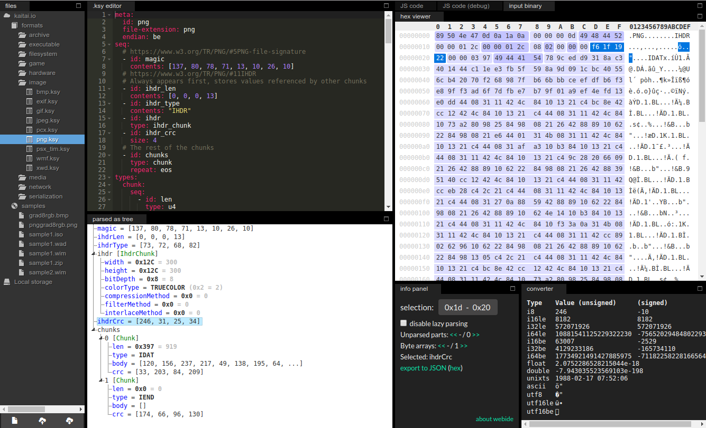
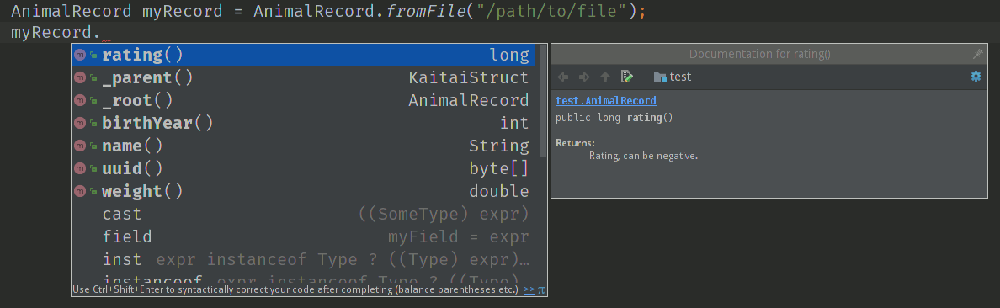

= Kaitai Struct User Guide
Kaitai Project
v0.9
:toc: left
:numbered:

== Introduction

Kaitai Struct is a domain-specific language (DSL) that is designed
with one particular task in mind: dealing with arbitrary binary
formats.

Parsing binary formats is hard, and there's a reason for that: such
formats were designed to be machine-readable, not human-readable. Even
when one's working with a clean, well-documented format, there are
multiple pitfalls that await the developer: endianness issues,
in-memory structure alignment, variable size structures, conditional
fields, repetitions, fields that depend on other fields previously
read, etc, etc, to name a few.

Kaitai Struct tries to isolate the developer from all these details
and allow to focus on the things that matter: the data structure
itself, not particular ways to read or write it.

== Installation and invocation

Kaitai Struct has somewhat diverse infrastructure around it, this
chapter will give an overview of the options available.

=== Web IDE

If you're going to try Kaitai Struct for the first time, then probably
it's the easiest way to get started. Just open
https://ide.kaitai.io/[Kaitai Struct Web IDE] and you're
ready to go:



A list of Web IDE features is available https://github.com/kaitai-io/kaitai_struct_webide/wiki/Features[on _kaitai_struct_webide_ GitHub wiki].

Note that there are *two* different versions of the Web IDE:

1. https://ide.kaitai.io/ — *stable* version, has the stable of the Kaitai Struct compiler (currently 0.8, released 2018-02-05)
2. https://ide.kaitai.io/devel/ — unstable development version, has always the *latest* compiler (the most recent 0.9-SNAPSHOT)

If you want to use the latest features, use the https://ide.kaitai.io/devel/[*devel* Web IDE].

=== Desktop / console version

If you don't fancy using a hex dump in a browser, or played around
with that and want to integrate Kaitai Struct into your project build
process automation, you'd want a desktop / console solution. Of
course, Kaitai Struct offers that as well.

==== Installation

Please refer to http://kaitai.io/#download[official website] for
installation instructions. After installation, you're expected to
have:

* `ksc` (or `kaitai-struct-compiler`) — command-line Kaitai Struct
  compiler, a program that translates `.ksy` into parsing libraries in
  a chosen target language.
* `ksv` (or `kaitai-struct-visualizer`, optional) — console visualizer

NOTE: `ksc` shorthand might be not available if your system doesn't
support symbolic links — just use the full name then.

If you're going to invoke `ksc` frequently, you'd probably want to add
it to your executable searching `PATH`, so you don't have to type full
path to it every time. You'd get that automatically on .deb package
and Windows .msi install (provided you don't disable that option) -
but it might take some extra manual setup if you use a generic .zip
package.

[[invocation]]
==== Invocation

Invoking `ksc` is easy:

[source,shell]
----
ksc [options] <file>...
----

Common options:

* `<file>...` — source files (.ksy)
* `-t <language> | --target <language>` — target languages (`cpp_stl`,
  `csharp`, `java`, `javascript`, `perl`, `php`, `python`, `ruby`, `all`)
** `all` is a special case: it compiles all possible target
    languages, creating language-specific directories (as per language
    identifiers) inside output directory, and then creating output
    module(s) for each language starting from there
* `-d <directory> | --outdir <directory>` — output directory
  (filenames will be auto-generated)

Language-specific options:

* `--dotnet-namespace <namespace>` — .NET namespace (C# only, default: Kaitai)
* `--java-package <package>` — Java package (Java only, default: root package)
* `--php-namespace <namespace>` — PHP namespace (PHP only, default: root package)

Misc options:

* `--verbose` — verbose output
* `--help` — display usage information and exit
* `--version` — output version information and exit

== Workflow overview

As you might have already read on the project's website, the main idea
of Kaitai Struct is that you create a description of a binary data
structure format using a formal language, save it as `.ksy` file, and
then you compile it with KS compiler into target programming language

TODO

== Kaitai Struct language

With the workflow issues out of the way, let's concentrate on the Kaitai
Struct language itself.

=== Fixed-size structures

Probably the simplest thing KS can do is reading fixed-size structures.
You might know them as C struct definitions — consider something like
this fictional database entry that keeps track of the dog show
participants:

[source,c]
----
struct {
    char uuid[16];       /* 128-bit UUID */
    char name[24];       /* Name of the animal */
    uint16_t birth_year; /* Year of birth, used to calculate the age */
    double weight;       /* Current weight in kg */
    int32_t rating;      /* Rating, can be negative */
} animal_record;
----

And here is how it would look in .ksy:

[source,yaml]
----
meta:
  id: animal_record
  endian: be
seq:
  - id: uuid
    size: 16
  - id: name
    type: str
    size: 24
    encoding: UTF-8
  - id: birth_year
    type: u2
  - id: weight
    type: f8
  - id: rating
    type: s4
----

It's the https://learnxinyminutes.com/docs/yaml/[YAML]-based format,
plain and simple. Every .ksy file is a type description. Everything
starts with a `meta` section: this is where we specify top-level info on
the whole structure we describe. There are two important things here:

* `id` specifies name of the structure
* `endian` specifies default
https://en.wikipedia.org/wiki/Endianness[endianness]:
** `be` for big-endian (AKA "network byte order", AKA Motorola, etc)
** `le` for little-endian (AKA Intel, AKA VAX, etc)

With that out of the way, we use `seq` element with an array (ordered
sequence of elements) in it to describe which attributes this structure
consists of. Every attribute includes several keys, namely:

* `id` is used to give attribute a name
* `type` designates attribute type:
** no type means that we're dealing with just a raw byte array; `size`
is to be used to designate number of bytes in this array
** `s1`, `s2`, `s4`, `u1`, `u2`, `u4`, etc for integers
*** "s" means signed, "u" means unsigned
*** number is the number of bytes
*** if you need to specify non-default endianness, you can force it by
appending `be` or `le` — i.e. `s4be`, `u8le`, etc
** `f4` and `f8` for IEEE 754 floating point numbers; `4` and `8`,
again, designate the number of bytes (single or double precision)
*** if you need to specify non-default endianness, you can force it by
appending `be` or `le` — i.e. `f4be`, `f8le`, etc
** `str` is used for strings; that is almost the same as "no type", but
string has a concept of encoding, which must be specified using
`encoding`

YAML-based syntax might look a little more verbose than C-like struct,
but there are a few good reasons to use it. It is consistent, it is
easily extendable, and it's easy to parse, so it's easy to make your own
programs/scripts that work with .ksy specs.

[[docstrings]]
=== Docstrings

A very simple example is that we can add docstrings to every attribute,
using syntax like that:

[source,yaml]
----
  - id: rating
    type: s4
    doc: Rating, can be negative
----

These docstrings are just the comments in .ksy, they'll actually get
exported into target language as well (for example, in Java they'll
become JavaDoc, in Ruby they'll become RDoc/YARD, etc). This, in turn,
is super helpful when editing the code in various IDEs that will
generate reminder popups for intelligent completion, when you browse
through class attributes:



NOTE: You can use https://learnxinyminutes.com/docs/yaml/[YAML]
folded style strings for longer documentation that spans multiple lines:

[source,yaml]
----
  - id: opcode
    type: u1
    doc: |
      Operation code that defines which operation should be performed
      by a virtual machine. Subsequent parameters for operation depend
      on the value of opcode.
----

=== Checking for "magic" signatures

Many file formats use some sort of safeguard measure against using
completely different file type in place of the required file type. The
simple way to do so is to include some "magic" bytes (AKA "file
signature"): for example, checking that first bytes of file are equal to
their intended values provides at least some degree of protection
against such blunders.

To specify "magic" bytes (i.e. fixed content) in structures, KS includes
a special `contents` key. For example, this is the beginning of a `seq`
for Java .class file:

[source,yaml]
----
seq:
  - id: magic
    contents: [0xca, 0xfe, 0xba, 0xbe]
----

This reads first 4 bytes and compares them to 4 bytes `CA FE BA BE`. If
there would be any mismatch (or there would be less than 4 bytes read),
that'll throw an exception and stop parsing at an early stage, before any
damage (pointless allocation of huge structures, waste of CPU cycles)
would be done.

Note that `contents` is very flexible and you can specify there:

* An UTF-8 string — bytes from such a string would be used to check
against
* An array with:
** bytes in decimal representation
** bytes in hexadecimal representation, starting with 0x
** UTF-8 strings

In case of using an array, all elements' byte representations would be
concatenated and expected in sequence. Few examples:

[source,yaml]
----
  - id: magic1
    contents: JFIF
    # expects bytes: 4A 46 49 46
  - id: magic2
    # we can use YAML block-style arrays as well
    contents:
      - 0xca
      - 0xfe
      - 0xba
      - 0xbe
    # expects bytes: CA FE BA BE
  - id: magic3
    contents: [CAFE, 0, BABE]
    # expects bytes: 43 41 46 45 00 42 41 42 45
----

More extreme examples to illustrate the idea (i.e. possible, but
definitely not recommended in real-life specs):

[source,yaml]
----
  - id: magic4
    contents: [foo, 0, A, 0xa, 42]
    # expects bytes: 66 6F 6F 00 41 0A 2A
  - id: magic5
    contents: [1, 0x55, '▒,3', 3]
    # expects bytes: 01 55 E2 96 92 2C 33 03
----

NOTE: There's no need to specify `type` or `size` for fixed contents
data — it all comes naturally from the `contents`.

=== Variable-length structures

Many protocols and file formats tend to conserve bytes, especially for
strings. Sure, it's stupid to have a fixed 512-byte buffer for a string
that typically is 3-5 bytes long and only rarely can be up to 512 bytes.

One of the most common methods used to mitigate this problem is to use
some integer to designate length of the string, and store only
designated number of bytes in the stream. Unfortunately, this yields
variable-length structure, and it's impossible to describe such thing
using C-style structs. However, it's not a problem for KS:

[source,yaml]
----
seq:
  - id: my_len
    type: u4
  - id: my_str
    type: str
    size: my_len
    encoding: UTF-8
----

Note the `size` field: we use not a constant, but a reference to a field
that we've just parsed from a stream. Actually, you can do much more
than that — you can use a full-blown expression language in `size`
field. For example, what if we're dealing with UTF-16 string and
`my_len` value designates not a number of bytes, but number of byte
pairs?

[source,yaml]
----
seq:
  - id: my_len
    type: u4
  - id: my_str
    type: str
    size: my_len * 2
    encoding: UTF-16LE
----

One can just multiply `my_len` by 2 — and voila — here's our UTF-16
string. Expression language is very powerful, we'll be talking more
about it later.

Last, but not least, we can specify a `size` that spans automatically to
the end of the stream. For that one, we'll use slightly different
syntax:

[source,yaml]
----
seq:
  - id: some_int
    type: u4
  - id: string_spanning_to_the_end_of_file
    type: str
    encoding: UTF-8
    size-eos: true
----

[[delimited-struct]]
=== Delimited structures

NOTE: All features specified in this section are demonstrated on
strings, but the same features should work on any user types as well.

Another popular way to avoid allocating huge fixed-size buffers is to
use some sort of trailing delimiter. The most well-known example of
this is probably null-terminated string which became a standard of
strings representation in C:

....
61 62 63 00
....

This 4 bytes actually represent 3-character string "abc", and extra
one trailing byte "0" (AKA null) serves as a delimiter or
terminator. By agreement, C strings cannot include 0 byte: every time
a function in C sees that either in stream or in memory, it considers
that as special mark to stop processing.

In Kaitai Struct, you can define all sorts of delimited
structures. For example, this is how you define a null-terminated
string:

[source,yaml]
----
seq:
  - id: my_string
    type: str
    terminator: 0
    encoding: UTF-8
----

As this is a very common thing, there's a shortcut for `type: str` and
`terminator: 0`. One can write it as this:

[source,yaml]
----
seq:
  - id: my_string
    type: strz
    encoding: UTF-8
----

Of course, you can use any other byte (for example, `0xa`, AKA
newline) as a terminator. This gives Kaitai Struct some limited
capabilities to parse of certain text formats as well.

Reading "until the terminator byte is encountered" could be
dangerous. What if we'll never encounter that byte?

Another very widespread model is actually having *both* a fixed-sized
buffer for a string *and* a terminator. This is typically an artifact
of serializing structures like this from C. For example, if one would
just take this example structure:

[source,c]
----
struct {
    char name[16];       /* Name of the animal */
    uint16_t birth_year; /* Year of birth, used to calculate the age */
} animal_record;
----

and will do the following in C:

[source,c]
----
struct animal_record rec;
strcpy(rec.name, "Princess");
// then, after some time, the same record is reused
strcpy(rec.name, "Sam");
----

After first `strcpy` operation, the buffer will look like that:

....
50 72 69 6e|63 65 73 73|00 ?? ?? ??|?? ?? ?? ??| |Princess.???????|
....

And after the second `strcpy`, the the following will remain in the
memory:

....
53 61 6d 00|63 65 73 73|00 ?? ?? ??|?? ?? ?? ??| |Sam.cess.???????|
....

Effectively, the buffer is still 16 bytes, but the only meaningful
contents it has is up to first null terminator. Everything beyond that
is garbage left over from either buffer not being initialized at all
(these `??` bytes could contain anything), or it will contain parts of
strings previously occupying this buffer.

It's easy to model that kind of behavior in Kaitai Struct as well,
just by combining `size` and `terminator`:

[source,yaml]
----
seq:
  - id: name
    type: str
    size: 16
    terminator: 0
    encoding: UTF-8
----

This works in 2 steps:

* `size` always that exactly 16 bytes would be read from the stream.
* `terminator`, given that `size` is present, only works inside these
  16 bytes, cutting string short early with the first terminator byte
  encountered, saving application from getting all that trailing
  garbage.

[[enums]]
=== Enums (named integer constants)

The nature of binary format encoding dictates us that in many cases
we'll be using some kind of integer constants to encode certain
entities. For example, a widely known IP packet uses 1-byte integer to
encode protocol type for the payload: 6 would mean "TCP" (which gives us
infamous TCP/IP), 17 would mean "UDP" (which yields UDP/IP), and 1 means
"ICMP".

It is possible to live with just raw integers, but most programming
language actually provide a way to program using meaningful string names
instead. This approach is usually dubbed "enums" and it's totally
possible to generate an enum in KS:

[source,yaml]
----
seq:
  - id: protocol
    type: u1
    enum: ip_protocol
enums:
  ip_protocol:
    1: icmp
    6: tcp
    17: udp
----

There are two things that should be done to declare a enum:

1.  We add `enums` key on the type level (i.e. on the same level as
`seq` and `meta`). Inside that key, we add a map, keys of it being names
of enum (in this example, there's only one enum declared, `ip_protocol`)
and values being yet another map, which maps integer values into
identifiers.
2.  We add `enum: ...` parameter to every attribute that's going to be
represented by that enum, instead of just being a raw integer. Note that
such attributes must have some sort of integer type in the first place
(i.e. `type: u*` or `type: s*`).

=== Substructures (subtypes)

What do we do if we need to use many of the strings in such a format?
Writing so many repetitive `my_len`- / `my_str`-style pairs would be so
bothersome and error-prone. Fear not, we can define another type,
defining it in the same file, and use it as a custom type in a stream:

[source,yaml]
----
seq:
  - id: track_title
    type: str_with_len
  - id: album_title
    type: str_with_len
  - id: artist_name
    type: str_with_len
types:
  str_with_len:
    seq:
      - id: len
        type: u4
      - id: value
        type: str
        encoding: UTF-8
        size: len
----

Here we define another type named `str_with_len`, which we reference
just by doing `type: str_with_len`. The type itself is defined using
`types:` key on top-level type. That's a map, inside it we can define as
many subtypes as we want. We define just one, and inside it we just nest
the exact same syntax as we use for the type description on the top
level — i.e. the same `seq` designation.

NOTE: There's no need for `meta` here, as type name is derived from
`types` key name here.

Of course, one can actually have more levels of subtypes:

TODO

=== Accessing attributes in other types

Expression language (used, for example, in `size` key) allows you to
refer not only attributes in current type, but also in other types.
Consider this example:

[source,yaml]
----
seq:
  - id: header
    type: main_header
  - id: body
    size: header.body_len
types:
  main_header:
    seq:
      - id: magic
        contents: MY-SUPER-FORMAT
      - id: body_len
        type: u4
----

If `body_len` attribute was in the same type as `body`, we could just
use `size: body_len`. However, in this case we've decided to split the
main header into separate subtype, so we'll have to access it using `.`
operator — i.e. `size: header.body_len`.

Obviously, one can chain attributes with `.` to dig deeper into type
hierarchy — i.e. `size: header.subheader_1.subsubheader_1_2.field_4`.
But sometimes we need just the opposite: how do we access upper-level
elements from lower-level types? KS provides two options here:

==== `_parent`

One can use special pseudo-attribute `_parent` to access parent
structure:

[source,yaml]
----
TODO
----

==== `_root`

In some cases, it would be way too impractical to write tons of
`_parent._parent._parent._parent...` or just plain impossible (if you're
describing an type which might be used on several different levels, thus
different number of `_parent` would be needed). In this case, we can use
special pseudo-attribute `_root` to just start navigating from the very
top-level type:

TODO

[source,yaml]
----
seq:
  - id: header
    type: main_header
types:
  main_header:
    seq:
      - id: magic
        contents: MY-SUPER-FORMAT
      - id: body_len
        type: u4
      - id: subbody_len
        type: u4
----

=== Conditionals

Some protocols and file formats have optional fields, which only exist
in some conditions. For example, one can have some byte first that
designates if some field exists (1) or not (0). In KS, you can do that
using `if` key:

[source,yaml]
----
seq:
  - id: has_crc32
    type: u1
  - id: crc32
    type: u4
    if: has_crc32 != 0
----

In this example, we again use expression language to specify a boolean
expression in `if` key. If that expression is true, field is parsed and
we'll get a result. If that expression is false, field will be skipped
and we'll get a `null` or it's closest equivalent in our target
programming language if we'll try to get it.

At this point, you might wonder how that plays together with enums.
After you mark some integer as "enum", it's no longer just an integer,
so you can't compare it directly with the number. Instead you're
expected to compare it to other enum values:

[source,yaml]
----
seq:
  - id: my_animal
    type: u1
    enum: animal
  - id: dog_tag
    type: u4
    # Comparing to enum literal
    if: my_animal == animal::dog
enums:
  animal:
    1: cat
    2: dog
----

There are other enum operations available, we'll cover them in
expression language guide later.

=== Repetitions

Most real-life file formats do not contain only one copy of some
element, but might contain several copies, i.e. they repeat the same
pattern over and over. Repetition might be:

* element repeated up to the very end of the stream
* element repeated a pre-defined number of times
* element repeated while some condition is satisfied (or until some
condition won't become true)

KS supports all these types of repetitions. In all cases, it will create
a resizable array (or nearest equivalent available in target language)
and populate it with elements.


[[repeat-eos]]
==== Repeat until end of stream

This is the simplest kind of repetition, done by specifying
`repeat: eos`. For example:

[source,yaml]
----
seq:
  - id: numbers
    type: u4
    repeat: eos
----

This yields an array of unsigned integers, each is 4 bytes long, which
spans till the end of the stream. Note that if we've got a number of bytes left in the
stream that's not divisible by 4 (for example, 7), we'll end up reading
as much as possible, and then parsing procedure will throw an
end-of-stream exception. Of course, you can do that with any type,
including user-defined types (subtypes):

[source,yaml]
----
seq:
  - id: filenames
    type: filename
    repeat: eos
types:
  filename:
    seq:
      - id: name
        type: str
        size: 8
        encoding: ASCII
      - id: ext
        type: str
        size: 3
        encoding: ASCII
----

This one defines an array of records of type `filename`. Each individual
`filename` consists of a 8-byte `name` and 3-byte `ext` strings in ASCII
encoding.

==== Repeat for a number of times

One can repeat an element a certain number of times. For that, we'll
need an expression that will give us number of iterations (which would
be exactly the number of items in resulting array). It could be a simple
constant to read exactly 12 numbers:

[source,yaml]
----
seq:
  - id: numbers
    type: u4
    repeat: expr
    repeat-expr: 12
----

Or we might reference some attribute here to have an array with length
specified inside the format:

[source,yaml]
----
seq:
  - id: num_floats
    type: u4
  - id: floats
    type: f8
    repeat: expr
    repeat-expr: num_floats
----

Or, using expression language, we can even do some more complex math on
it:

[source,yaml]
----
seq:
  - id: width
    type: u4
  - id: height
    type: u4
  - id: matrix
    type: f8
    repeat: expr
    repeat-expr: width * height
----

This one specifies `width` and `height` of the matrix first, then parses
as many `matrix` elements as needed to fill a `width` × `height` matrix
(although note that it won't be a true 2D matrix: it would still be just
a regular 1D array, and you'll need to convert (x, y) coordinate to
address in that 1D array manually).

==== Repeat until condition is met

Some formats don't specify the number of elements in array, but instead
just use some sort of special element as a terminator that signifies end
of data. KS can do that as well using `repeat-until` syntax, for
example:

[source,yaml]
----
seq:
  - id: numbers
    type: s4
    repeat: until
    repeat-until: _ == -1
----

This one reads 4-byte signed integer numbers until encountering `-1`. On
encountering `-1`, the loop will stop and further sequence elements (if
any) will be processed. Note that `-1` would still be added to array.

Underscore (`_`) is used as a special variable name that refers to the
element that we've just parsed. When parsing an array of user types, it
is possible write a `repeat-until` expression that would reference some
attribute inside that user type:

[source,yaml]
----
seq:
  - id: records
    type: buffer_with_len
    repeat: until
    repeat-until: _.len == 0
types:
  buffer_with_len:
    seq:
      - id: len
        type: u1
      - id: value
        size: len
----

[[tlv]]
=== Typical TLV implementation (switching types on an expression)

"TLV" stands for "type-length-value", and it's a very common staple in
many formats. The basic idea is that we do modular and
reverse-compatible format. On the top level, it's very simple: we know
that the whole format is just an array of records (`repeat: eos` or
`repeat: expr`). Each record starts the same: there is some marker that
specifies _type_ of the record and an integer that specifies record's
__length__. After that, record's body follows, and the body format
depends on the _type_ marker. One can easily specify that basic record
outline in KS like that:

[source,yaml]
----
seq:
  - id: rec_type
    type: u1
  - id: len
    type: u4
  - id: body
    size: len
----

However, how do we specify the format for `body` that depends on
`rec_type`? One of the approaches is using conditionals, as we've seen
before:

[source,yaml]
----
seq:
  - id: rec_type
    type: u1
  - id: len
    type: u4
  - id: body_1
    type: rec_type_1
    size: len
    if: rec_type == 1
  - id: body_2
    type: rec_type_2
    size: len
    if: rec_type == 2
  # ...
  - id: body_unidentified
    size: len
    if: rec_type != 1 and rec_type != 2 # and ...
----

However, it's easy to see why it's not a very good solution:

* We end up writing lots of repetitive lines
* We create lots of `body_*` attributes in a type, while in reality only
one `body` would exist — everything else would fail the `if` comparison
and thus would be null
* If we want to catch up the "else" branch, i.e. match everything not
matched with our `if`s, we have to write an inverse of sum of `if`s
manually. For anything more than 1 or 2 types it quickly becomes a mess.

That is why KS offers an alternative solution. We can use switch type
operation:

[source,yaml]
----
seq:
  - id: rec_type
    type: u1
  - id: len
    type: u4
  - id: body
    size: len
    type:
      switch-on: rec_type
      cases:
        1: rec_type_1
        2: rec_type_2
----

This is much more concise and easier to maintain, isn't it? And note
that `size` is specified on attribute level, thus it applies to all
possible type values, setting us a good hard limit. What's even better -
even if you're missing the match, as long as you have `size` specified,
you would still parse `body` of a given size, but instead of
interpreting it with some user type, it will be treated as having no
`type`, thus yielding a raw byte array. This is super useful, as it
allows you to work on TLV-like formats step-by-step, starting with
support of only 1 or 2 types of records, and gradually adding more and
more types.

[CAUTION]
=====
One need to make sure that type used in `switch-on` and types used
in `cases` are either identical or at least comparable. For example,
comparing string against integers will yield a compile-time error:

[source,yaml]
----
seq:
  - id: rec_type
    type: strz
  - id: body
    type:
      switch-on: rec_type
      cases:
        1: rec_type_1
        2: rec_type_2
----

Here, `rec_type` is declared as string and cases are comparing it to
integers. So, compiler will complain:

```
/seq/1/type/cases/IntNum(1): can't compare StrFromBytesType(...) and Int1Type(true)
```
=====

You can use "_" for the default (else) case which will match every
other value which was not listed explicitly.

[source,yaml]
----
    type:
      switch-on: rec_type
      cases:
        1: rec_type_1
        2: rec_type_2
        _: rec_type_unknown
----

Switching types can be a very useful technique. For more advanced
usage examples, see <<switch-advanced>>.

=== Instances: data beyond the sequence

So far we've done all the data specifications in `seq` — thus they'll
get parsed immediately from the beginning of the stream, one-by-one, in
strict sequence. But what if the data you want is located at some other
position in the file, or comes not in sequence?

"Instances" are the Kaitai Struct's answer for that. They're specified
in a key `instances` on the same level as `seq`. Consider this example:

[source,yaml]
----
meta:
  id: big_file
  endian: le
instances:
  some_integer:
    pos: 0x400000
    type: u4
  a_string:
    pos: 0x500fff
    type: str
    size: 0x11
    encoding: ASCII
----

Inside `instances` we need to create a map: keys in that map would be
attribute names, and values specify attribute in the very same manner as
we would have done it in `seq`, but there is one important additional
feature: using `pos: ...` one can specify a position to start parsing
that attribute from (in bytes from the beginning of the stream). Just as
in `size`, one may use expression language and reference other
attributes in `pos`. This is used very often to allow accessing file
body inside a container file when we have some file index data: file
position in container and length:

[source,yaml]
----
seq:
  - id: file_name
    type: str
    size: 8 + 3
    encoding: ASCII
  - id: file_offset
    type: u4
  - id: file_size
    type: u4
instances:
  body:
    pos: file_offset
    size: file_size
----

Another very important difference between `seq` attribute and
`instances` attribute is that instances are lazy by default. What does
it mean? Unless someone would call that `body` getter method
programmatically, no actual parsing of `body` would be done. This is
super useful for parsing larger files, such as images of filesystems. It
is impractical for a filesystem user to load all the filesystem data
into memory at once: one usually finds a file by its name (traversing
file index somehow), and then can access file's `body` right away. If
that's the first time this file is being accessed, `body` will be loaded
(and parsed) into RAM. Second and all subsequent times will just return
a cached copy from the RAM, avoiding any unnecessary re-loading /
re-parsing, thus conserving both RAM and CPU time.

Note that from the programming point of view (from the target
programming languages and from internal Kaitai Struct's expression
language), `seq` attributes and `instances` are exactly the same.

=== Calculated ("value") instances

Sometimes, it is useful to transform the data (using expression
language) and store it as a named value. There's another sort of
instances for that — calculated (AKA "value") instances. They're very
simple to use, there's only one key in it — `value` — that specifies
expression to calculate:

[source,yaml]
----
seq:
  - id: length_in_feet
    type: f8
instances:
  length_in_m:
    value: length_in_feet * 0.3048
----

Value instance does no actual parsing, and thus do not require `pos`
key, or `type` key (type will be derived automatically).

=== Bit-sized integers

IMPORTANT: Feature available since v0.6.

Quite a few protocols and file formats, especially those who aim to
conserve space, pack multiple integers into same byte, using integer
sizes less than 8 bits. For example, IPv4 packet starts with a byte
that packs both version and header length:

....
76543210
vvvvllll
  |   |
  |   +- header length
  +----- version
....

Here's how it can be parsed with KS:

[source,yaml]
----
seq:
  - id: version
    type: b4
  - id: header_len
    type: b4
----

NOTE: By convention, KS starts parsing bits from most significant to
least significant, so "version" comes first here, and "header_len"
second.

Using `type: bX` (where X is a number of bits to read) is very
versatile and can be used to read byte-unaligned data. A more complex
example of packing, where value spans two bytes:

....
76543210 76543210
aaaaabbb bbbbbbcc
....

[source,yaml]
----
seq:
  - id: a
    type: b5
  - id: b
    type: b9
    # 3 bits + 6 bits
  - id: c
    type: b2
----

Or it can be used to parse completely unaligned bit streams with
repetitions. In this example, we parse an arbitrary number of 3-bit
values:

....
           76543210 76543210 76543210 76543210
           nnnnnnnn 00011122 23334445 55666777 ...
           ----+--- ---___----___---____
               |     |  |  |   |  |   |
num_threes ----+     |  |  |   |  |   |
threes[0]  ----------+  |  |   |  |   |
threes[1]  -------------+  |   |  |   |
threes[2]  ----------------+   |  |   |
threes[3]  --------------------+  |   |
threes[4]  -----------------------+   |
threes[5]  ---------------------------+
  ...
....

[source,yaml]
----
seq:
  - id: num_threes
    type: u1
  - id: threes
    type: b3
    repeat: expr
    repeat-expr: num_thress
----

[IMPORTANT]
====
By default, if you'll mix "normal" byte-sized integers (i.e. `uX`,
`sX`) and bit-sized integers (i.e. `bX`), byte-sized integers will be
kept byte-aligned. That means if you do:

[source,yaml]
----
seq:
  - id: foo
    type: b6
  - id: bar
    type: u1
----

two bytes will get parsed like that:

....
    76543210 76543210
    ffffff   bbbbbbbb
    --+---   ---+----
      |         |
foo --+         |
bar ------------+
....

i.e. two least significant bits of the first byte would be lost and
not parsed due to alignment.
====

Last, but not least, note that it's also possible to parse bit-packed
integers using old-school methods with value instances. Here's the
very first example with IPv4 packed start, unpacked manually:

[source,yaml]
----
seq:
  - id: packed_1
    type: u1
instances:
  version:
    value: packed_1 & 0b00001111
  header_len:
    value: packed_1 >> 4
----

Such method is useful when you need to do more intricate bit
combinations, like a value with its bits scattered across several
bytes sparsely.

[[ksy-documentation]]
=== Documenting your spec

We've introduced `doc` key <<docstrings,early in this user guide>> as
a simple way to add docstrings to the attributes. However, it's not
only attributes that can be documented. The same `doc` key can be used
in several different contexts:

[source,yaml]
----
doc: |
  Documentation for type. Works for top-level types too, in case you
  were wondering.
seq:
  - id: attr_1
    type: u1
    doc: Documentation for sequence attribute.
instances:
  attr_2:
    pos: 0x1234
    type: u1
    doc: Documentation for parse instance attribute.
  attr_3:
    value: attr_2 + 1
    doc: Documentation for value instance attribute.
types:
  some_type:
    doc: Documentation for type as well. Works for inner types too.
params:
  - id: param_1
    type: u1
    doc: |
      Documentation for a parameter. Parameters are relatively
      advanced topic, see below for the explanations.
----

[[doc-ref]]
==== `doc-ref`

`doc` key has a "sister" key `doc-ref`, which can be used to specify
references to original documentation. This is very useful to keep
track of what corresponds to what when transcribing an existing
specification. Everywhere where you can use `doc`, you can use
`doc-ref` as well. Depending on target language, this key would be
rendered as something akin to "see also" extra paragraph after the
main docstring. For example:

[cols="a,a", frame=none]
|====
|
.Kaitai Struct
[source,yaml]
----
seq:
  - id: len_record
    type: u1
    doc: Total length of record in bytes.
    doc-ref: ISO spec, section 1.2.3
----
|
.Java
[source,java]
----
/**
 * Total length of record in bytes.
 * @see "ISO-9876 spec, section 1.2.3"
 */
public int lenRecord() { return lenRecord; }
----
|====

Inside `doc-ref`, one can specify:

* Just a user-readable string. Most widely used to reference offline documentation. User would need to find relevant portion of documentation manually.
+
[source,yaml]
----
doc-ref: ISO-9876 spec, section 1.2.3
----

* Just a link. Used when existing documentation has non-ambiguous,
  well defined URL that everyone can refer to, and there's nothing
  much to add to it.
+
[source,yaml]
----
doc-ref: https://www.youtube.com/watch?v=dQw4w9WgXcQ
----

* Link + description. Used when adding some extra text information is
  beneficial: for example, when URL is not enough and needs some
  comments on how to find relevant info inside the document, or the
  document is also accessible through some other means and it's useful
  to specify both URL and section numbering for those who won't be
  using URL. In this case, `doc-ref` is composed of URL, then a space,
  then description.
+
[source,yaml]
----
doc-ref: https://tools.ietf.org/html/rfc2795#section-6.1 RFC2795, 6.1 "SIMIAN Client Requests"
----

[[orig-id]]
==== `-orig-id`

When transcribing spec based on some existing implementation, most
likely you won't be able to keep exact same spelling of all
identifiers. Kaitai Struct imposes pretty draconian rules on what can
be used as `id`, and there is a good reason for it: different target
languages have different ideas of what constitutes a good identifier,
so Kaitai Struct had to choose some "middle ground" that yields decent
results when converted to all supported languages' standards.

However, in many cases, it might be useful to keep references to how
things were named in original implementation. For that, one can
customarily use `-orig-id` key:

[source,yaml]
----
seq:
  - id: len_str_buf
    -orig-id: StringBufferSize
    type: u4
  - id: str_buf
    -orig-id: StringDataInputBuffer
    size: len_str_buf
----

[TIP]
====
Kaitai Struct compiler would just ignore any key that starts with
`-`, and silently allow it. These kind of keys can be used to store
arbitrary additional information, which can be accessible to external
tools (i.e. other than the compiler). Feel free to add more arbitrary
keys if you need to store extra structured information for some
reason. For example, if you have 2 concurrent existing implementations
in C++ and Java, you can store IDs for both of them for future
reference:

[source,yaml]
----
seq:
  - id: foo_bar
    -getter-id-cpp: get_foo_bar()
    -getter-id-java: getFooBar()
----
====

[[verbose-enums]]
==== Verbose enums

IMPORTANT: Feature available since v0.8.

If you want to add some documentation for enums, this is possible
using verbose enums declaration:

[source,yaml]
----
enums:
  ip_protocol:
    1:
      id: icmp
      doc: Internet Control Message Protocol
      doc-ref: https://www.ietf.org/rfc/rfc792
    6:
      id: tcp
      doc: Transmission Control Protocol
      doc-ref: https://www.ietf.org/rfc/rfc793
    17:
      id: udp
      doc: User Datagram Protocol
      doc-ref: https://www.ietf.org/rfc/rfc768
----

In this format, instead of specifying just the identifier for every
numeric value, you specify YAML map, which has `id` key for
identifier, and allows other regular keys (like `doc` and `doc-ref`)
to specify documentation.

[[meta]]
=== Meta section

`meta` key is used to define a section which stores meta-information
about a given type, i.e. various complimentary stuff, such as titles,
descriptions, pointers to external linked resources, etc:

* `id`
* `title`
* `application`
* `file-extension`
* `xref` — used to specify <<meta-xref,cross-references>>
* `license`
* `ks-version`
* `ks-debug`
* `ks-opaque-types`
* `imports`
* `encoding`
* `endian`

TIP: While it's technically possible to specify `meta` keys in
arbitary order (as in any other YAML map), please use order
recommended in <<ksy_style_guide.adoc#meta,style guide>> when
authoring .ksy specs for public use to improve readability.

[[meta-xref]]
==== Cross-references

`meta/xref` can be used to provide arbitrary cross-references for a
particular type in other collections, such as references / IDs in
format databases, wikis, encyclopedias, archives, formal standards,
etc. Syntactically, it's just a place where you can store arbitrary
key-value pairs, e.g.:

[source,yaml]
----
meta:
  xref:
    forensicswiki: Portable_Network_Graphics_(PNG)
    iso: '15948:2004'
    justsolve: PNG
    loc: fdd000153
    mime: image/png
    pronom:
      - fmt/13
      - fmt/12
      - fmt/11
    rfc: 2083
    wikidata: Q178051
----

There are several "well-known" keys used by convention by many spec
authors to provide good cross references of their formats:

* `forensicswiki` specifies article name at
  https://forensicswiki.xyz/page/Main_Page[Forensics Wiki], which is a
  CC-BY-SA-licensed wiki with information on digital forensics, file
  formats and tools. Full link name could be generated as
  `https://forensicswiki.xyz/page/` + this value.
* `iso` key specifies ISO/IEC standard number, reference to a standard
  accepted and published by https://www.iso.org/[ISO] (International
  Organization for Standardization). Typically these standards are not
  available for free (i.e. one has to pay to get a copy of a standard
  from ISO), and it's non-trivial to link to ISO standards
  catalogue. However, ISO standards typically have clear designations
  like "ISO/IEC 15948:2004", so value should be citing everything
  except for "ISO/IEC", i.e. `15948:2004`.
* `justsolve` specifies article name at
  http://fileformats.archiveteam.org/wiki/Main_Page["Just Solve the File Format
  Problem" wiki], a wiki that collects information on many file
  formats. Full link name could be generated as
  `http://fileformats.archiveteam.org/wiki/` + this value.
* `loc` key is used to specify identifier in
  https://www.loc.gov/preservation/digital/formats/fdd/browse_list.shtml[Digital
  Formats] database of https://www.loc.gov/[US Library of Congress], a
  major effort to enumerate and document many file formats for digital
  preservation purposes. Value typically looks like `fddXXXXXX`, where
  `XXXXXX` is a 6-digit identifier.
* `mime` key is used to specify
  https://en.wikipedia.org/wiki/Media_type[MIME (Multipurpose Internet
  Mail Extensions) type], AKA "media type" designation, a string
  typically used in various Internet protocols to specify format of
  binary payload. As of 2019, there is a
  https://www.iana.org/assignments/media-types/media-types.xhtml[central
  registry of media types] managed by IANA. Value must specify full
  MIME type (both parts), e.g. `image/png`.
* `pronom` key specifies format identifier in
  https://www.nationalarchives.gov.uk/PRONOM/Default.aspx[PRONOM
  Technical Registry] of https://www.nationalarchives.gov.uk/[UK
  National Archives], which is a massive file formats database that
  catalogues many file formats for digital preservation
  purposes. Value typically looks like `fmt/xxx`, where `xxx` is a
  number assigned at PRONOM (this idenitifer is called "PUID", AKA
  "PRONOM Unique Identifier" in PRONOM itself). If many different
  PRONOM formats correspond to a particular spec, specify them as YAML
  array (see example above).
* `rfc` key is used to specify reference to
  https://en.wikipedia.org/wiki/Request_for_Comments[RFC], "Request
  for Comments" documents maintained by ISOC (Internet
  Society). Despite the confusing name, RFCs are typically treated as
  global, Internet-wide standards, and, for example, many networking /
  interoperability protocols are specified in RFCs. Value should be
  just raw RFC number, without any prefixes, e.g. `1234`.
* `wikidata` specifies item name at
  https://www.wikidata.org/wiki/Wikidata:Main_Page[Wikidata], a global knowledge base. All
  Wikimedia projects (such as language-specific Wikipedias,
  Wiktionaries, etc) use Wikidata at least for connecting various
  translations of encyclopedic articles on a particular subject, so
  keeping just a link to Wikidata is typically enough to.  Value
  typically follows `Qxxx` pattern, where `xxx` is a number generated
  by Wikidata, e.g. `Q535473`.

== Streams and substreams

Imagine that we're dealing with structures of known size. For sake of
simplicity, let's say that it's fixed to exactly 20 bytes (but all the
following is also true if the size is defined by some arbitrarily
complex expression):

[source,yaml]
----
types:
  person:
    seq:
      - id: code
        type: u4
      - id: name
        type: str
        size: 16
----

When we're invoking user-defined types, we can do either:

[source,yaml]
----
seq:
  - id: joe
    type: person
----

or:

[source,yaml]
----
seq:
  - id: joe
    type: person
    size: 20
----

Note the subtle difference: we've skipped the `size` in first example
and added it in the second one. From end-user's perspective, nothing
has changed. You can still access Joe's code and name equally well in
both cases:

[source,java]
----
r.joe().code() // works
r.joe().name() // works
----

However, what gets changed under the hood? It turns out that
specifying `size` actually brings some new features: if you modify
`person` type to be less than 20 bytes long, it still reserves exactly
20 bytes for `joe`:

[source,yaml]
----
seq:
  - id: joe        # reads from position 0
    type: person
    size: 20
  - id: foo
    type: u4       # reads from position 20
types:
  person: # although this type is 14 bytes long now
    seq:
      - id: code
        type: u4
      - id: name
        type: str
        size: 10
----

In this example, extra 6 bytes would be just skipped. Alternatively,
if you'll somehow make `person` to be more than 20 bytes long, it will
trigger an end-of-stream exception:

[source,yaml]
----
seq:
  - id: joe
    type: person
    size: 20
  - id: foo
    type: u4
types:
  person: # 100 bytes is longer than 20 bytes declared in `size`
    seq:
      - id: code
        type: u4
      - id: name # will trigger an exception here
        type: str
        size: 96
----

How does it work? Let's take a look under the hood. Sizeless user type
invocation generates the following parsing code:

[source,java]
----
this.joe = new Person(this._io, this, _root);
----

However, when we declare the `size`, things get a little bit more
complicated:

[source,java]
----
this._raw_joe = this._io.readBytes(20);
KaitaiStream _io__raw_joe = new KaitaiStream(_raw_joe);
this.joe = new Person(_io__raw_joe, this, _root);
----

Every class that KS generates carries a concept of "stream", usually
available as `_io` member. This is the default stream it reads from
and writes to. This stream works just as you might expect from a
regular IO stream implementation in you average language: it
encapsulates reading from files and memory, stores pointer to its
current position, and allows reading/writing of various primitives.

Declaring new user-defined type in the middle of `seq` attributes
generates new object (usually via constructor call), and this object,
in turn, needs its own IO stream. So, what are our options here?

* In "sizeless" case, we just pass current `_io` along to the new
  object. This "reuses" the existing stream with all its properties:
  current pointer position, size, available bytes, etc.
* In "sized" case, we know the size a priori and want the object we
  created to be limited within that size. So, instead of passing an
  existing stream, instead we create a new substream that will be
  shorter and will contain exact number of bytes requested.

Implementations vary from language to language, but, for example, in
Java, the following is done:

[source,java]
----
// First, we read as many bytes as needed from our current IO stream.
// Note that if we don't even have 20 bytes right now, this will throw
// an EOS exception on this line, and user type won't even be invoked.
this._raw_joe = this._io.readBytes(20);

// Second, we wrap our bytes into a new stream, a substream
KaitaiStream _io__raw_joe = new KaitaiStream(_raw_joe);

// Finally, we pass our substream to Person class instead of
this.joe = new Person(_io__raw_joe, this, _root);
----

After that, parsing of `person` type will be totally bound to limits
of that particular substream. Anything in Person class whatsoever
can't do a thing to original stream — it just doesn't have access to
that object, period.

Let's check out a few use cases that demonstrate how powerful this
practice can be.

=== Limiting total size of structure

Quite often binary formats use the following technique:

* First comes some integer that declares total size of the structure
  (or structure's body, i.e. everything minus this length header).
* Then comes structure's body, which is expected to have exactly
  declared number of bytes.

Consider this example:

[source,yaml]
----
seq:
  - id: body_len
    type: u4

  # The following must be exactly `body_len` bytes long
  - id: uuid
    size: 16
  - id: name
    type: str
    size: 24
  - id: price
    type: u4
  # This "comment" entry must fill up all remaining bytes up to the
  # total of `body_len`.
  - id: comment
    size: ???
----

Of course, one can derive this manually:

* body_len = sizeof(uuid) + sizeof(name) + sizeof(price) + sizeof(comment)
* body_len = 16 + 24 + 4 + sizeof(comment)
* sizeof(comment) = body_len - (16 + 24 + 4)
* sizeof(comment) = body_len - 44

Thus:

[source,yaml]
----
  - id: comment
    size: body_len - 44
----

But this is very inconvenient and potentially error prone. What will
happen if at some time in future the record contents will be updated
and we'll forget to update this formula?

It turns out that substreams offer a much cleaner solution here. Let's
separate our "header" and "body" into two distinct user types, and
then we can just specify `size` on this `body`:

[source,yaml]
----
seq:
  - id: body_len
    type: u4
  - id: body
    type: record_body
    size: body_len
    # ^^ This is where substream magic kicks in
types:
  record_body:
    seq:
      - id: uuid
        size: 16
      - id: name
        type: str
        size: 24
      - id: price
        type: u4
      - id: comment
        size-eos: true
----

For `comment`, we just made it to have size up until the end of
stream. Given that we've limited it to the substream in the first
place, this means exactly what we wanted.

[[repeat-until-size-limit]]
=== Repeating until total size reaches limit

The same technique might be useful for repetitions as well. If you
have an array of same-type entries, and a format declares total size
of all entries combined, again, you can try to do this:

[source,yaml]
----
seq:
  - id: total_len
    type: u4
  - id: entries
    type: entry
    repeat: expr
    repeat-expr: ???
----

And do some derivations to calculate number of entries,
i.e. "total_len / sizeof(entry)". But, again, this is bad because:

* You need to keep remembering to update this "sizeof" value when
  entry size updates.
* If entry size if not fixed, then you're totally out of luck here.

Solving it using substreams is much more elegant. You just create a
substream limited to `total_len` bytes, and then use `repeat: eos` to
repeat until the end of that stream.

[CAUTION]
=====
However, note that one's naïve approach might not work:

* When we're dealing with an array of elements, `size` will refer to
  the size of one particular element of the array.
* Any repetition (and this includes `repeat: eos`) parses the elements
  using the current IO stream. If `size` is specified, substreams
  are created individually for each object inside the loop.

So this is *wrong* (`total_len` determines the size
of each individual `entry` substream here):

[source,yaml]
----
seq:
  - id: total_len
    type: u4
  - id: entries
    type: entry
    size: total_len
    repeat: eos
----

For more information, see <<keys-repeated>>.

=====

The proper solution is to add an extra layer of types:

[source,yaml]
----
seq:
  - id: total_len
    type: u4
  - id: entries
    type: file_entries
    size: total_len
    # ^^ here we added the limit and created a single substream
types:
  file_entries:
    seq:
      - id: entries
        type: entry
        repeat: eos
        # ^^ repeats until the end of that limited substream
  entry:
    # ...
    # Now, this can even be of variable size: that's totally ok.
----

=== Relative positioning

Another useful feature that's possible with substreams is the fact
while you're in a substream, `pos` key works in context of that
substream as well. That means it addresses data relatively to that
substream:

[source,yaml]
----
seq:
  - id: some_header
    size: 20
  - id: body
    type: block
    size: 80
types:
  block:
    seq:
      - id: foo
        type: u4
    instances:
      some_bytes_in_the_middle:
        pos: 30
        size: 16
----

In this example, `body` allocates a substream spanning from 20th byte
(inclusive) till 100th byte (exclusive). Then, in that stream:

* `foo` would be parsed right from the beginning of that substream,
  thus taking up bytes `[20..24)`
* `some_bytes_in_the_middle` would start parsing 16 bytes from 30th
  byte *of a substream*, thus parsing bytes `[20 + 30 .. 20 + 46)` =
  `[50..66)` in the main stream.

This comes super handy if your format's internal structures somehow
specify offsets relative to some other structures of the format. For
example, a typical filesystem/database often uses concept of blocks
and offsets address stuff inside the current block. Note how KSY with
substreams is easier to read, more concise and less error-prone:

[cols="a,a", frame=none]
|====
|
.Good (w/substream)
[source,yaml]
----
seq:
  - id: len_block
    type: u4
instances:
  some_block:
    pos: 12345 * len_block
    size: len_block
    type: data_block
types:
  data_block:
    seq:
      - id: ofs_data
        type: u2
    instances:
      data:
        pos: ofs_data
        # relative to data_block
        size: 40
----
|
.Bad (w/o substream)
[source,yaml]
----
seq:
  - id: len_block
    type: u4
instances:
  some_block:
    pos: 12345 * len_block
    # no size => no substream!
    type: data_block
types:
  data_block:
    seq:
      - id: ofs_data
        type: u2
    instances:
      data:
        pos: 12345 * _root.len_block + ofs_data
        # have to calculate position manually
        size: 40
----
|====

The more levels of structure offset nesting there, the more
complicated these `pos` expression would get without substreams.

=== Absolute positioning

If you'd ever need to "escape" the limitations of a substream when
using a `pos` key of a parse instance and address something absolutely
(i.e. in the main stream), it's easy to do so by adding `io` key to
choose root's stream:

[source,yaml]
----
seq:
  - id: some_header
    size: 20
  - id: files
    size: 80
    type: file_entry
    repeat: eos
types:
  file_entry:
    seq:
      - id: file_name
        type: strz
      - id: ofs_body
        type: u4
      - id: len_body
        type: u4
    instances:
      body:
        io: _root._io
        pos: ofs_body
        size: len_body
----

That's the typical situation encountered in many file container
formats. Here we have a list of `files`, and each of its entries has
been limited to exactly 80 bytes. Inside each 80-byte chunk, there's a
`file_name`, and, more importantly, pointer to absolute location of
the file's body inside the file. `body` instance allows us to get that
file's body contents quickly and easily. Note that if there was no
`io: _root._io` key there, that `body` would have been parsed inside a
80-byte substream (and most likely that would result in an exception
trying to read outside of 80 byte limit), and that's not what we want
here.

=== Choosing a substream

Of course, the technique above is not limited to just the root
object's stream. You can address any other object's stream as well,
for example:

[source,yaml]
----
seq:
  - id: global_header
    size: 1024
  - id: block_one
    type: big_container
    size: 4096
  - id: block_two
    type: smaller_container
    size: 1024
types:
  big_container:
    seq:
      - id: some_header
        size: 8
      # the rest of the data in this container would be referenced
      # from other blocks
  smaller_container:
    seq:
      - id: ofs_in_big
        type: u4
      - id: len_in_big
        type: u4
    instances:
      something_in_big:
        io: _root.block_one._io
        pos: ofs_in_big
        size: len_in_big
----

[[process]]
=== Processing: dealing with compressed, obfuscated and encrypted data

Some formats obscure the data fully or partially with techniques like
compression, obfuscation or encryption. In this cases, incoming data
should be pre-processed before actual parsing would take place, or we'll
just end up with the garbage getting parsed. All such pre-processing
algorithms has one thing in common: they're done by some function that
takes a stream of bytes and return the stream of bytes (note that number
of incoming and resulting bytes might be different, especially in case
of decompression). While it might be possible to do such transformation
in declarative manner, it is usually impractical to do so.

KS allows to plug-in some predefined "processing" algorithms that allow
to do mentioned decompression, de-obfuscation and decryption to get a
clear stream, ready to be parsed. Consider parsing a file, in which the
main body is obfuscated by applying XOR with 0xaa for every byte:

[source,yaml]
----
seq:
  - id: body_len
    type: u4
  - id: body
    size: body_len
    process: xor(0xaa)
    type: some_body_type # defined normally later
----

Note that:

* Applying `process: ...` is available only to raw byte arrays or user
types.
* One might use expression language inside `xor(...)`, thus referencing
XOR obfuscation key read in the same format into some other field
previously

== Expression language

Expression language is a powerful internal tool inside Kaitai
Struct. In a nutshell, it is a simple object-oriented, statically-type
language that gets translated/compiled (AKA "transpiled") into any
supported target programming language.

The language is designed to follow the principle of least surprise, so
it borrows tons of elements from other popular languages, like C,
Java, C#, Ruby, Python, JavaScript, Scala, etc.

=== Basic data types

Expression language operates on the following primitive data types:

[cols="3*", options="header"]
|===
|Type
|Attribute specs
|Literals

|Integers
|`type: uX`, `type: sX`, `type: bX`
|`1234`, `-789`, `0xfc08`, `0b1101`

|Floating point numbers
|`type: fX`
|`123.0`, `-456.78`, `4.1607804e+72`

|Booleans
|`type: b1`
|`true`, `false`

|Byte arrays
|`size: XXX`, `size-eos: true`
|`[0x20, 65, 66, 67]`

|Strings
|`type: str`, `type: strz`
|`'foo bar'`, `"baz\nqux"`

|Enums
|(`type: uX` or `type: sX`) and `enum: XXX`
|`opcode::jmp`

|Streams
|N/A
|N/A
|===

*Integers* come from `uX`, `sX`, `bX` type specifications in sequence
or instance attributes (i.e. `u1`, `u4le`, `s8`, `b3`, etc), or can be
specified literally. One can use:

* normal decimal form (i.e. `123`)
* hexadecimal form using `0x` prefix (i.e. `0xcafe` — both upper case and lower case letters are legal, i.e. `0XcAfE` or `0xCAfe` will do as well)
* binary form using `0b` prefix (i.e. `0b00111011`)
* octal form using `0o` prefix (i.e. `0o755`)

It's possible to use `_` as a visual separator in literals — it would
be completely ignored by parser. This could be useful, for example,
to:

* visually separate thousands in decimal numbers: `123_456_789`
* show individual bytes/words in hex: `0x1234_5678_abcd`
* show nibbles/bytes in binary: `0b1101_0111`

*Floating point numbers* also follow the normal notation used in vast
majority of languages: `123.456` will work, as well as exponential
notation: `123.456e-55`. Use `123.0` to enforce floating point type to
an otherwise integer literal.

*Booleans* can be specified as literal `true` and `false` values as in
most languages, but also can be derived by using `type: b1`. This
method parses a single bit from a stream and represents it as a
boolean value: 0 becomes false, 1 becomes true. This is very useful to
parse flag bitfields, as you can omit `flag_foo != 0` syntax and just
use something more concise, such as `is_foo`.

*Byte arrays* are defined in the attribute syntax when you don't
specify anything as `type`. Size of byte array is thus determined
using `size`, `size-eos` or `terminator`, one which is mandatory in
this case. Byte array literals use typical array syntax like the one
used in Python, Ruby and JavaScript: i.e. `[1, 2, 3]`. There is a
little catch here: the same syntax is used for "true" arrays of
objects (see below), so if you'll try to do stuff like `[1, 1000, 5]`
(`1000` obviously won't fit in a byte), you won't get a byte array,
you'll get array of integers instead.

*Strings* normally come from using `type: str` (or `type: strz`, which
is actually a shortcut that also implicitly adds `terminator: 0`).
Literal strings can be specified using double quotes or single
quotes. The meaning of single and double quotes is similar to those of
Ruby, PHP and Shell script:

* Single quoted strings are interpreted literally, i.e. backslash `\`,
  double quotes `"` and other possible special symbols carry no
  special meaning, they would be just considered a part of the
  string. Everything between single quotes is interpreted literally,
  i.e. there is no way one can include a single quote inside a single
  quoted string.
* Double quoted strings support escape sequences and thus allow to
  specify any characters. The supported escape sequences are as
  following:

[cols="1,1,1,3", options="header"]
|===
|Escape seq
|Code (dec)
|Code (hex)
|Meaning

|`\a`
|7
|0x7
|bell

|`\b`
|8
|0x8
|backspace

|`\t`
|9
|0x9
|horizontal tab

|`\n`
|10
|0xa
|newline

|`\v`
|11
|0xb
|vertical tab

|`\f`
|12
|0xc
|form feed

|`\r`
|13
|0xd
|carriage return

|`\e`
|27
|0x1b
|escape

|`\"`
|34
|0x22
|double quote

|`\'`
|39
|0x27
|single quote (technically not required, but supported)

|`\\`
|92
|0x5c
|backslash

|`\123`
|
|
|ASCII character with octal code 123; one can specify 1..3 octal digits

|`\u12bf`
|
|
|Unicode character with code U+12BF; one must specify exactly 4 hex digits

|===

NOTE: One of the most widely used control characters, ASCII zero
character (code 0) can be specified as `\0` — exactly as it works in
most languages.

CAUTION: Octal notation is prone to errors: due to its flexible
length, it can swallow decimal digits that appear after the code as
part of octal specification. For example, `a\0b` is three characters:
`a`, ASCII zero, `b`. However, `1\02` is interpreted as two
characters: `1` and ASCII code 2, as `\02` is interpreted as one octal
escape sequence.

TODO: Enums

*Streams* are internal objects that track the byte stream that we
parse and state of parsing (i.e. where's the pointer at). There is no
way to declare a stream-type attribute directly by parsing
instructions or specify it as a literal. Typical way to get stream
objects is to query `_io` attribute from a user-defined object: that
will give us a stream associated with this particular object.

=== Composite data types

There are two composite data types in the expression language
(i.e. data types which include other types as components).

==== User-defined types

Basically, that's the types one defines using `.ksy` syntax -
i.e. top-level structure and all substructures defined in `types` key.

Normally, they are translated into classes (or their closest available
equivalent — i.e. storage structure with members + access members) in
target language.

==== Arrays

Array types are just what one might expect from all-purpose, generic
array type. Arrays come from either using the repetition syntax
(`repeat: ...`) in attribute specification, or by specifying a literal
array. In any case, all KS arrays have underlying data type that they
store, i.e. one can't put strings and integers into the same
array. One can do arrays based on any primitive data type or composite
data type.

NOTE: "True" array types (described in this section) and "byte arrays"
share the same literal syntax and lots of method API, but they are
actually very different types. This is done on purpose, because many
target languages use very different types for byte arrays and arrays
of objects for performance reasons.

One can use array literals syntax to declare an array (very similar to
syntax used in JavaScript, Python and Ruby). Type will be derived
automatically based on types of values inside brackets, for example:

* `[123, 456, -789]` — array of integers
* `[123.456, 1.234e+78]` — array of floats
* `["foo", "bar"]` — array of strings
* `[true, true, false]` — array of booleans
* `[a0, a1, b0]` — given that `a0`, `a1` and `b0` are all the same
  objects of user-defined type `some_type`, this would be array of
  user-defined type `some_type`

WARNING: Mixing multiple different types in a single array literal
would trigger a compile-time error, for example, this is illegal: `[1,
"foo"]`

=== Operators

Literals can be connected using operators to make meaningful
expressions. Operators are type-dependent: for example, same `+`
operator applied to two integers would mean arithmetic addition, and
applied to two strings would mean string concatenation.

==== Arithmetic operators

Can be applied to integers and floats:

* `a + b` — addition
* `a - b` — subtraction
* `a * b` — multiplication
* `a / b` — division
* `a % b` — modulo; note that it's not a remainder: `-5 % 3` is `1`,
  not `-2`; the result is undefined for negative `b`.

NOTE: If both operands are integer, result of arithmetic operation is
integer, otherwise it is floating point number. For example, that
means that `7 / 2` is `3`, and `7 / 2.0` is `3.5`.

Can be applied to strings:

* `a + b` — string concatenation

==== Relational operators

Can be applied to integers, floats and strings:

* `a < b` — true if `a` is strictly less than `b`
* `a \<= b` — true if `a` is less or equal than `b`
* `a > b` — true if `a` is strictly greater than `b`
* `a >= b` — true if `a` is greater or equal than `b`

Can be applied to integers, floats, strings, booleans and enums (does
proper string value comparison):

* `a == b` — true if `a` is equal to `b`
* `a != b` — true if `a` is not equal to `b`

==== Bitwise operators

Can be only applied to integers.

* `a << b` — left bitwise shift
* `a >> b` — right bitwise shift
* `a & b` — bitwise AND
* `a | b` — bitwise OR
* `a ^ b` — bitwise XOR

==== Logical (boolean) operators

Can be only applied to boolean values.

* `not x` — boolean NOT
* `a and b` — boolean AND
* `a or b` — boolean OR

==== Ternary (if-then-else) operator

If `condition` (must be boolean expression) is true, then `if_true`
value is returned, otherwise `if_false` value is returned:

[source,java]
----
condition ? if_true : if_false

// Examples
code == block_type::int32 ? 4 : 8
"It has a header: " + (has_header ? "Yes" : "No")
----

[NOTE]
====
`if_true` and `if_false` must have compatible types. As some
languages (for example, C++ and, to some extent, Java) do not allow
storage of, for example, strings, integers and byte arrays in the same
variable, it's generally a bad idea to do something like `foo ? 123 :
"some_string"` or `foo ? true : [12, 34]`.

It is acceptable to mix:

* integer of various origins and sizes — it would result in universal
  "one size fits all" integer for a target language
* integers and floats — it would result in "one size fits all"
  floating point type
* strings of various origin and encodings
* booleans of various origin
* objects of different user-defined types — it would result in a
  generic KaitaiStruct object
====

[CAUTION]
====
Using ternary operator inside a KSY file (which must remain a valid YAML
file) might be tricky, as some YAML parsers do not allow colons (`:`)
inside strings literals. So, trying something like that would fail in
some parsers (namely, it *will* fail using "desktop"
kaitai-struct-compiler running under JVM):

[source,yaml]
----
instances:
  foo:
    value: condition ? 4 : 8
----

To ensure maximum compatibility, put quotes around such strings, i.e:

[source,yaml]
----
instances:
  foo:
    value: 'condition ? 4 : 8'
----
====

=== Methods

Just about every value in expression language is an object (including
literals), and it's possible to call methods on it. The common syntax
to use is `obj.method(param1, param2, ...)`, which can be abbreviated
to `obj.method` if no parameters are required.

Note that then `obj` in question is a user-defined type, you can
access all its attributes (both sequence and instances) using the same
`obj.attr_name` syntax. Obviously, one can chain that to traverse a
chain of substructures: `obj.foo.bar.baz` (given that `obj` is a
user-defined type that has `foo` field, which points to user-defined
type that has `bar` field, and so on).

There are a few pre-defined methods that form kind of a "standard
library" for expression language.

==== Integers

[cols="3*", options="header"]
|===
|Method name
|Return type
|Description

|`to_s`
|String
|Converts integer into a string using decimal representation
|===

==== Floating point numbers

[cols="3*", options="header"]
|===
|Method name
|Return type
|Description

|`to_i`
|Integer
|Truncates a floating point number to an integer
|===

==== Byte arrays

[cols="3*", options="header"]
|===
|Method name
|Return type
|Description

|`length`
|Integer
|Number of bytes in the array

|`to_s(encoding)`
|String
|Decodes (converts) a byte array encoded using the specified `encoding` scheme into a string
|===

==== Strings

[cols="3*", options="header"]
|===
|Method name
|Return type
|Description

|`length`
|Integer
|Length of a string in number of characters

|`reverse`
|String
|Reversed version of a string

|`substring(from, to)`
|String
|Extracts a portion of a string between character at offset `from` and character at offset `to - 1` (including `from`, excluding `to`)

|`to_i`
|Integer
|Converts string in decimal representation to an integer

|`to_i(radix)`
|Integer
|Converts string with number stored in `radix` representation (i.e. use `16` to get hexadecimal representation, use `8` to get octal, etc) to an integer
|===

==== Enums

[cols="3*", options="header"]
|===
|Method name
|Return type
|Description

|`to_i`
|Integer
|Converts enum into corresponding integer representation
|===

==== Booleans

[cols="3*", options="header"]
|===
|Method name
|Return type
|Description

|`to_i`
|Integer
|Returns `0` if the boolean value is `false` or `1` if the boolean value is `true`
|===

==== User-defined types

All user-defined types can be queried to get attributes (sequence
attributes or instances) by their name. In addition to that, there are
a few pre-defined internal methods (they all start with an underscore
`_`, so they can't clash with regular attribute names):

[cols="3*", options="header"]
|===
|Method name
|Return type
|Description

|`_root`
|User-defined type
|Top-level user-defined structure in current file

|`_parent`
|User-defined type
|Structure that produced this particular instance of user-defined type

|`_io`
|Stream
|Stream associated with this object of user-defined type
|===

==== Array types

[cols="3*", options="header"]
|===
|Method name
|Return type
|Description

|`first`
|Array base type
|Gets first element of the array

|`last`
|Array base type
|Gets last element of the array

|`size`
|Integer
|Number of elements in the array

|`min`
|Array base type
|Gets the minimum element of the array

|`max`
|Array base type
|Gets the maximum element of the array
|===

==== Streams

[cols="3*", options="header"]
|===
|Method name
|Return type
|Description

|`eof`
|Boolean
|`true` if we've reached end of the stream (no more data can be read from it), `false` otherwise

|`size`
|Integer
|Total size of the stream in bytes

|`pos`
|Integer
|Current position in the stream, in bytes from the beginning of the stream
|===

== Advanced techniques

[[switch-advanced]]
=== Advanced switching

==== Switching over strings

One can use type switching technique over any other comparable values
beside integers. For example, one can switch over a string value. Note
that left side (key) of `cases` map is a full-featured KS expression,
thus all we need is to specify a string. Don't forget that there's
still YAML syntax that might get in a way, so we effectively need to
quote strings twice: once for KS expression language, and once in the
YAML representation to save these quotes from being interpreted by
YAML parser, i.e.:

[source,yaml]
----
seq:
  - id: rec_type
    type: strz
  - id: body
    type:
      switch-on: rec_type
      cases:
        '"KETCHUP"': rec_type_1
        '"MUSTARD"': rec_type_2
        '"GUACAMOLE"': rec_type_3
----

If target language allows switching over strings, it will be rendered
as `switch`-style statement, or, if it does not, ksc will fall back to
`if`-based rendition.

==== Switching over enums

One can use enums as well. To match against enum values, you would
have to specify enum literals (i.e. `enum_name::some_value`), and,
given that it involves semicolons, we'll have to use YAML quotes
again:

[source,yaml]
----
seq:
  - id: rec_type
    type: u2
    enum: media
  - id: body
    type:
      switch-on: rec_type
      cases:
        'media::cdrom': rec_type_1
        'media::dvdrom': rec_type_2
        'media::cassette': rec_type_3
----

==== FourCC

Quite a few formats (like TIFF, RIFF, AVI, etc) use a thing called
"FourCC" to switch over in a typical TLV implementation. "FourCC"
(which stands for "four character code") is essentially a 4-byte
value, which is often made human-readable to aid debugging. It's
usually tempting to use a fixed-size string and match it against a
list of strings:

[source,yaml]
----
seq:
  - id: fourcc
    type: str
    size: 4
    encoding: ASCII
  - id: len
    type: u4
  - id: body
    size: len
    type:
      switch-on: fourcc
      cases:
        '"RGB2"': block_rgb2
        '"RLE4"': block_rle4
        '"RLE8"': block_rle8
----

However, this is generally a bad idea:

* Reading and matching strings is slow. At least it's much slower than
  reading a single 4-byte integer (because it often involves multiple
  copying of data, encoding checks / conversions, etc). The whole
  point of using 4-byte FourCC originally was to provide a fast way to
  read it in single operation.
* It's hard to provide an encoding for such a string. Quite a few
  formats introduced non-ASCII FourCC values, and, even if all current
  values are ASCII-safe, there's no guarantee that there would be no
  weird values like `C6 A2 ED 39` in future.

The recommended way to handle FourCC-style types is using an enum:

[source,yaml]
----
seq:
  - id: fourcc
    type: u4le
    enum: pixel_formats
  - id: len
    type: u4
  - id: body
    size: len
    type:
      switch-on: fourcc
      cases:
        'pixel_formats::rgb2': block_rgb2
        'pixel_formats::rle4': block_rle4
        'pixel_formats::rle8': block_rle8
enums:
  pixel_formats:
    0x32424752: rgb2
    0x34454C52: rle4
    0x38454C52: rle8
----

This runs as fast as it was originally intended, and it provides extra
benefits of allowing more verbose FourCC value descriptions.

WARNING: Until
https://github.com/kaitai-io/kaitai_struct/issues/300[Issue #300] is
resolved, this approach cannot be used unless you can guarantee that
every possible FourCC value the file might contain is defined in the
enum. Otherwise you will encounter unavoidable parse exceptions in
Java and Python, preventing you from accessing further data from the
file.

[[do-nothing]]
=== Do nothing

In some rare cases, you need a type that actually does absolutely
nothing. For example, you purposely want to ignore parsing certain
switch case and avoid running it through default type, i.e. situation
like that:

[source,yaml]
----
seq:
  - id: rec_type
    type: u4
  - id: body
    type:
      switch-on: rec_type
      cases:
        1: rec_type_1
        2: rec_type_2
        3: dummy # <= must ignore rec_type=3!
        _: rec_type_others
----

This is very easy to achieve, here are a few examples of type
definitions which do nothing when invoked:

[source,yaml]
----
types:
  # One can use empty JSON object syntax to avoid specifying any of
  # `seq`, `instances`, etc, sections.
  dummy_1: {}
  # One can use explicit doc to note that it's nothing there.
  dummy_2:
    doc: This type is intentionally left blank.
  # One can use empty `seq` or `instances` or `types` section, any
  # other empty sections, or any combination of thereof.
  dummy_3:
    seq: []
    instances: {}
    types: {}
  # Very explicit notion of the fact that we want to parse 0 bytes.
  dummy_4:
    seq:
      - id: no_value
        size: 0
----

[[delimited-struct-advanced]]
=== Advanced delimited structures

<<delimited-struct,Delimited structures>>, having `terminator`
specified to define a structure of arbitrary size, are pretty common
and useful. However, sometimes you're dealing with more advanced
versions of these which require you to fine-tune certain aspects of
delimiting.

[[consume-include]]
==== Terminator: consume or include?

What happens with the terminator byte itself, when you're defining a
delimited structure? Normally, terminator is not needed inside your
structure, it's an external entity. For example, if you're parsing
dot-delimited strings, you don't want these strings to contain the
dot:

[cols="a,a", frame=none]
|====
|
.KSY
[source,yaml]
----
seq:
  - id: str1
    type: str
    terminator: 0x2e # `.`
  - id: str2
    type: str
    terminator: 0x2e # `.`
----
|
.Input and output

....
66 6f 6f 2e 62 61 72 2e = "foo.bar."

str1 = "foo"
str2 = "bar"
....

|====

But sometimes you indeed want that dot, and it should be part of
output. It is actually possible too, if you'll specify `include: true`
(the default it is false):

[cols="a,a", frame=none]
|====
|
.KSY
[source,yaml]
----
seq:
  - id: str1
    type: str
    terminator: 0x2e # `.`
    include: true
  - id: str2
    type: str
    terminator: 0x2e # `.`
    include: true
----
|
.Input and output

....
66 6f 6f 2e 62 61 72 2e = "foo.bar."

str1 = "foo."
str2 = "bar."
....

|====

Or sometimes your terminator is actually part of following structure,
and you don't want it to be consumed — you want you next structure to
start with that terminator byte. It's possible to do so too with
`consume: false` (which true by default):

[cols="a,a", frame=none]
|====
|
.KSY
[source,yaml]
----
seq:
  - id: str1
    type: str
    terminator: 0x2e # `.`
    consume: false
  - id: the_rest
    type: str
    size-eos: true
----
|
.Input and output

....
66 6f 6f 2e 62 61 72 2e = "foo.bar."

str1 = "foo"
the_rest = ".bar."
....

|====

[[eos-error]]
==== Ignoring errors in delimited structures

Delimited structures actually could be pretty scary: if we read until
the terminator is encountered, what will happen if we'll never find
one? In raw C, a typical answer is "segmentation fault" occurring in
the operation that deals with such string due to runaway reads past
the buffer, i.e. a very bad thing and a big security hole.

In Kaitai Struct, however, you can control this behavior. By default,
if you'll parse a structure awaiting for a terminator, and that
terminator never happens, you'll get a clear error / exception similar
to "attempted to read past end of stream". However, in some cases, you
really want to read until the end of stream, and this should be
considered normal encoding, not an error. For this cases, you can
specify `eos-error`:

[source,yaml]
----
seq:
  - id: my_string
    type: str
    terminator: 0
    eos-error: false
    encoding: UTF-8
----

This structure will read both terminated and non-terminated strings
successfully, without triggering an error:

....
61 62 63 00 64 65 66 => my_string = "abc"
61 62 63 00          => my_string = "abc"
61 62 63             => my_string = "abc"
....

=== Importing types from other files

As your project grows in complexity, you might want to have multiple
.ksy files: for example, for different file formats, structures,
substructures, or to reuse same subformat in several places. As most
programming languages, Kaitai Struct allows you to have multiple
source files and has `imports` functionality for that.

Using multiple files is very easy. For example, given that you have a
`date.ksy` file that describes the date structure:

[source,yaml]
----
meta:
  id: date
seq:
  - id: year
    type: u2le
  - id: month
    type: u2le
  - id: day
    type: u2le
----

and you want to use it in a file listing specification
`filelist.ksy`. Here's how to do that:

[source,yaml]
----
meta:
  id: filelist
  # this will import "date.ksy"
  imports:
    - date
seq:
  - id: entries
    type: entry
    repeat: eos
types:
  entry:
    seq:
      - id: filename
        type: strz
        encoding: ASCII
      # just use "date" type from date.ksy as if it was declared in
      # current file
      - id: timestamp
        type: date
      # you can access its members too!
      - id: historical_data
        size: 160
        if: timestamp.year < 1970
----

Generally, you just add an array in `meta/imports` and list all you
want to import there. There are 2 ways to address the files:

Relative::
  Uses path given as relative path to the file, starting with the same
  directory as main .ksy file resides. It's useful to include files in
  the same directory or to navigate to somewhere in your
  project. Examples include: `foo`, `foo/bar`, `../foo/bar/baz`, etc.
Absolute::
  Looks like `/foo` or `/foo/bar` (i.e. starting with a slash), and
  searches for the given .ksy file in module search path(s). This is
  usually used to modules from centralized repositories / ksy
  libraries. Module search paths are determined by (in order of
  decreasing priority):

  * Paths given using command-line `-I` switch.
  * Paths given using `KSPATH` environment variable (multiple paths
    can be specified separated with `:` on Linux/OS X and with `;` on
    Windows)
  * Default Platform-dependent search paths, determined in compiler
    build time and/or during installation

  In Web IDE you obviously don't have environment and command-line
  switches, so absolute path imports are used to reference modules in
  preloaded "kaitai.io" library.

CAUTION: Please use only forward slashes `/` in import paths for
consistency. Kaitai Struct will convert them automatically to proper
platform-dependent path separator (`/` or `\`).

[[opaque-types]]
=== Opaque types: plugging in external code

Sometimes you'd want KS-generated code to call a code in your
application to do the parsing, for example, to parse some text- or
state-based format. For that, you can instruct ksc to generate code
with so-called "opaque" types.

Normally, if a compiler encounters a type which is not declared either
in current file or in one of the imported files, for example:

[source,yaml]
----
meta:
  id: doc_container
seq:
  - id: doc
    type: custom_encrypted_object
----

\... it will output an error:

 /seq/0: unable to find type 'custom_encrypted_object', searching from doc_container

If we want to provide our own implementation of
`custom_encrypted_object` type, first we need to compile our .ksy file
with `--opaque-types=true` option. This will avoid the error, and
compiler will consider all unknown types to be "opaque", i.e. it will treat
them as existing in some external space.

Alternatively, instead of specifying command line argument
`--opaque-types=true` to the compiler, as of Kaitai Struct version 0.7,
it is now possible to specify `meta` field `ks-opaque-types` as follows:

[source,yaml]
----
meta:
  id: doc_container
  ks-opaque-types: true
seq:
  - id: doc
    type: custom_encrypted_object
----

NOTE: Of course, compiler don't know anything about opaque types, so
trying to access any attributes of it (i.e. using expression language)
will fail.

This will generate the following code (for example, in Java):

[source,java]
----
public class DocContainer extends KaitaiStruct {
    // ...
    private void _read() {
        this.doc = new CustomEncryptedObject(this._io);
    }
}
----

As you see, `CustomEncryptedObject` is instantiated here with a single
argument: IO stream. All that's left is to create a class with a
compatible constructor that will allow a call with single
argument. For statically typed languages, note that constructor's
argument is of type KaitaiStream.

An example of what can be done (in Java):

[source,java]
----
public class CustomEncryptedObject {
    byte[] buf;

    public CustomEncryptedObject(KaitaiStream io) {
        // read all remaining bytes into our buffer
        buf = io.readBytesFull();

        // implement our custom super Caesar's cipher
        for (int i = 0; i < buf.length; i++) {
            byte b = buf[i];
            if (b >= 'A' && b <= 'Z') {
                int letter = b - 'A';
                letter = (letter + 7) % 26;
                buf[i] = (byte) (letter + 'A');
            }
        }
    }
}
----

TIP: Alternatively, opaque types can be (ab)used to connect several
KS-generated types together without importing. If one type
instantiates other, but does not use it in any other way (i.e. doesn't
access its inner attributes using expression language), one can just
compile two .ksy files separately, throw them into the same project
and they shall use each other without a problem.

[[custom-process]]
=== Custom processing routines

IMPORTANT: Feature available since v0.8.

As discussed in <<process>>, Kaitai Struct utilizes `process` key to
invoke processing of the data for the purposes of "bytes in - bytes
out" transformation. It is meant to be used to implement compression &
decompression, encryption & decryption, obfuscation & de-obfuscation,
that kind of transformations.

Kaitai Struct runtime libraries come bundled with "standard" set of
such transformations, but quite often one would encounter the need to
implement some custom data transformation algorithm. There are many
thousands of encryption and compression algorithms. It's unpractical
to both try to implement them in declarative form using standard
Kaitai Struct types (because as end-user, you're most likely
interested in decoded result, not internal structures of the
algorithm/cipher), and it's next to impossible to bundle all the data
processing algorithms in the world into Kaitai Struct runtime (not
only it would become *very* bloated, but also quite a few such
algorithms are encumbered by software patents and licensing
restrictions).

To alleviate this problem, Kaitai Struct allows one to invoke custom
processing algorithms, implemented in imperative code in target
languages. This acts very similar to <<opaque-types,opaque external
types>>, but this one works for `process` invocations, not for `type`
invocations.

Calling a custom process type is easy:

[source,yaml]
----
seq:
  - id: key
    type: s4
  - id: buf
    size: 50
    process: my_custom_processor(key)
----

This would generate something like this (example is for Java, other
target languages use similar technique):

[source,java]
----
// Reads 50 bytes to process.
this._raw_buf = this._io.readBytes(50);

// Initializes processor object, passing every argument specified in
// `process` key into constructor
MyCustomProcessor _process__raw_buf = new MyCustomProcessor(key());

// Invokes `decode(...)` method, passing unprocessed byte array,
// expecting it to return a processed one.
this.buf = _process__raw_buf.decode(this._raw_buf);
----

Typical implementation of a custom processor would look like that
(again, example for in Java, refer to language-specific notes for
documentation on other languages):

[source,java]
----
import io.kaitai.struct.CustomDecoder;

public class MyCustomProcessor implements CustomDecoder {
    private int key;

    public CustomFx(int key) {
        this.key = key;
    }

    @Override
    public byte[] decode(byte[] src) {
        // custom "bytes in -> bytes out" processing routine
        byte[] dst = new byte[src.length];
        for (int i = 0; i < src.length; i++) {
           dst[i] = (byte) (src[i] + key);
        }

        return dst;
    }
}
----

This example is mostly self-explanatory. Strong typed languages, such
as Java, usually provide some sort of interface that such a custom
processor class should implement. For Java, it's named
`CustomDecoder`. And, as outlined there, we implement:

* a custom constructor, which accepts the encoding parameters (like
  keys, etc), as specified in a ksy
* a `decode(byte[] src)` method which decodes a given byte array — in
  this particular example, it just adds whatever we supplied as "key"
  to every byte

NOTE: `decode` can return different number of bytes that it gets
(which is perfectly normal, for example, for decompression).

By default, specifying a plain name invokes a custom processing class
in the same namespace/package where the code is generated. If you want
to keep your generated code in separate namespace/package than your
custom hand-made code, you can specify it like that:

[source,yaml]
----
seq:
  - id: buf
    size: 50
    process: com.example.my_rle(5, 3)
----

For Java, this would result in invocation of `com.example.MyRle`
class. Other languages use similar rules of translation, see
language-specific notes for details.

A special namespace prefix "kaitai." is reserved for extended
libraries provided by Kaitai project. As of 0.8, none of them were
published, but in future you can expect implementations like
"kaitai.crypto.aes" or "kaitai.compress.lzma" to be provided by
libraries implemented in multiple languages that would be released
along the minimal core Kaitai Struct runtime.

=== Enforcing parent type

Every object (except for the top-level object) in a .ksy file has a
parent, and that parent has a type, which is some sort of user-defined
type. What happens if two or more objects use the same type?

image::svg/two_parents.svg[float="right"]

[source,yaml]
----
types:
  opcode_jmp:
    seq:
      - id: target
        type: arg
  opcode_push:
    seq:
      - id: value
        type: arg
  arg:
    seq:
      - id: arg_type
        type: u1
      - id: arg_value
        type: u1
----

In this example, both opcodes use same type `arg`. Given that these
are different types, KS infers that the only thing they have in common
is that they are objects generated by Kaitai Struct, and thus they
usually implement KaitaiStruct API, so the best common type that will
be ok for both parents is `KaitaiStruct`. Here's how it looks in any
statically-typed language, i.e, in Java:

[source,java]
----
public static class OpcodeJmp extends KaitaiStruct {
    // ...
    private void _read() {
        this.target = new Arg(this._io, this, _root);
    }
    // ...
}
public static class OpcodePush extends KaitaiStruct {
    // ...
    private void _read() {
        this.value = new Arg(this._io, this, _root);
    }
    // ...
}
public static class Arg extends KaitaiStruct {
    public Arg(KaitaiStream _io, KaitaiStruct _parent, TopLevelClass _root) {
----

Note that both `OpcodeJmp` and `OpcodePush` supply `this` as `_parent`
argument in `Arg` constructor, and, as it is declared as
`KaitaiStruct`. As both opcode classes are declared with `extends
KaitaiStruct`, this code will compile properly.

==== Replacing parent

However, in some situations, you might want to replace default `this`
passed as `_parent` with something else. In some situations this will
provide you a clean and elegant solution to relatively complex
problems. Consider the following data structure that loosely
represents a binary tree:

[source,yaml]
----
types:
  tree:
    seq:
      - id: chunk_size
        type: u4
      - id: root_node
        type: node
  node:
    seq:
      - id: chunk
        size: ??? # <= need to reference chunk_size from tree type here
      - id: has_left_child
        type: u1
      - id: has_right_child
        type: u1
      - id: left_child
        type: node
        if: has_left_child != 0
      - id: right_child
        type: node
        if: has_right_child != 0
----

Everything is pretty simple here. Main `tree` type has `chunk_size`
and a `root_node`, which is of `node` type. Each individual `node` of
this tree carries a chunk of information (of size determined in `tree`
type), some flags (`has_left_child` and `has_right_child`) and then
calls itself again to parse either left or right child nodes for
current node if they exist, according to the flags.

The only problem is how to access `chunk_size` in each node. You can't
access tree object starting from `_root` here, as there could be many
different trees in our file, so you need to access current one. Using
`_parent` directly is just impossible. True, given that `node` type is
used both by `tree` and `node` itself, it got two different parents,
so Kaitai Struct compiler downgrades node's parent type to
KaitaiStruct, thus trying to access `_parent.chunk_size` would result
in a compile-time error.

TODO: add more about the error

This situation can be resolved easily by using parent overriding. We
modify our code this way:

[source,yaml]
----
types:
  tree:
    seq:
      - id: chunk_size
        type: u4
      - id: root_node
        type: node
  node:
    seq:
      - id: chunk
        size: _parent.chunk_size # <= now one can access `tree` with _parent
      - id: has_left_child
        type: u1
      - id: has_right_child
        type: u1
      - id: left_child
        type: node
        parent: _parent # <= override parent to be be parent's parent
        if: has_left_child != 0
      - id: right_child
        type: node
        parent: _parent # <= override parent here too
        if: has_right_child != 0
----

We've changed only three lines. We've enforced parent of the node in
`left_child` and `right_child` attributes to be passed as `_parent`,
not `this`. This, effectively, continues passing reference to original
node's parent, which is a `tree` type object, over and over the whole
recursive structure. This way one can access structure's root by just
using `_parent`. Naturally, we've done exactly that to get ourselves
`chunk_size` by just using `size: _parent.chunk_size`.

==== Omitting parent

In some cases, you'd rather want some object to don't have any parent
at all. Primary use case for that is to make sure that some
instantiation it does not affect parent type. In many cases, resorting
to this method is a sign that you need to stop and rethink your
design, but for some formats, it's unavoidable and in fact simplifies
things a lot.

To omit parent (i.e. pass `null` reference or something similar as a
parent in one particular case), use `parent: false`.

[NOTE]
====
Language design explanation: while it might seem logical to specify
`parent: null`, there are two catches:

* KSY is a YAML-based language, and YAML treats `parent: null` as
  literally null value, i.e. totally the same as `parent:`. So, just
  to allow passing solitary `null` to as a value, you'd need to wrap
  it into quotes: `parent: 'null'`. This would be very awkward for
  beginners, as we can't even generate a good error message here, as
  we can't distinguish these two.
* Omitting parent is actually a special case, not just a matter of
  passing `null`. In fact, some languages do not have a concept of
  null, or do not allow passing null as an object reference, so we
  need to treat it distinctly anyway, and emphasize that.
====

TODO: an example where omitting the parent comes useful

[[typecast]]
=== Typecasting

IMPORTANT: Feature available since v0.7.

Kaitai Struct always tries its best to infer all the types
automatically, but in some cases it would be impossible to do so in
compile-time. For example, there could be some extra conditions known
to format developer, but not to Kaitai Struct.

Consider this example — a typical image format, implemented as
<<tlv>>, which includes a variable number of self-describing sections:

[source,yaml]
----
seq:
  - id: num_sections
    type: u4
  - id: sections
    type: section
    repeat: expr
    repeat-expr: num_sections
types:
  section:
    seq:
      - id: sect_type
        type: u1
      - id: len
        type: u4
      - id: body
        size: len
        type:
          switch-on: sect_type
          cases:
            1: sect_header
            2: sect_color_data
            # ...
  sect_header:
    seq:
      - id: width
        type: u4
      - id: height
        type: u4
----

After that, a bitmap follows, and its size is to be derived as `width
* height`, as described in `sect_header` section. In addition to that,
we're 100% sure (due to format constraints) that body of `sections[7]`
is always `sect_header`. How do we access `width` and `height` in it?

A naïve solution like that won't compile:

[source,yaml]
----
  - id: bitmap
    size: sections[7].body.width * sections[7].body.height
----

reporting the following error:

....
/seq/2/size: don't know how to call anything on AnyType
....

The reason for that is that from root type perspective, all section
bodies are alike, and in a strongly typed language, it's impossible to
guarantee that `sections[7].body` would be the type we want, and that
type would have `width` and `height` attributes. Not only that, but
actually, given that we've specified `size` attribute, a `body` could
be just a raw byte array, and not even a user type. Thus, KS decided
that it could be `AnyType` — a type that can include anything.

The best solution would be to enforce our knowledge with explicit
typecast with `.as<...>` expression operator:

[source,yaml]
----
  - id: bitmap
    size: sections[7].body.as<sect_header>.width * sections[7].body.as<sect_header>.height
----

To make it prettier, one can extract
`sections[7].body.as<sect_header>` using a named value instance:

[source,yaml]
----
  # ...
  - id: bitmap
    size: header.width * header.height
instances:
  header:
    value: sections[7].body.as<sect_header>
----

CAUTION: Of course, if our assumption about `sections[7]` won't come
true in run time, things will go bad. You can expect most languages to
throw a typecasting exception on a failed casting attempt, but in very
low-level languages, such as C++ with RTTI disabled, this would result
in data accessed using wrong offsets, and that could potentially lead
to a crash / segfault / security problem.

[[calc-endian]]
=== Calculated default endianness

IMPORTANT: Feature available since v0.8.

Most formats (like http://formats.kaitai.io/zip/[zip],
http://formats.kaitai.io/gif/[gif], and many others) stick to a single
fixed endianness: they always use either big-endian or little-endian
integers. Usually it stems from the architecture where the format was
developed: this way format is relatively easy and quick to parse on
its "native" architecture, and requires some extra operations (and
parsing time) on non-native architectures.

Some formats (like http://formats.kaitai.io/elf/[ELF] or
http://formats.kaitai.io/mach_o/[Mach-O]), however, take alternative
approach: they come in two versions (with big-endian integers and
little-endian integers) and they add some sort of header field that
helps to distinguish between two.

To help implementing such formats, Kaitai Struct supports concept of
calculated endianness. Instead of using `endian: be` or `endian: le`,
one can use a switch, similar to the one introduced in
<<tlv>>. Consider this example of a TIFF file — it begins with either
"II" (0x49, 0x49) to specify little-endian encoding or "MM" (0x4d,
0x4d) to specify big-endian encoding:

[source,yaml]
----
meta:
  id: tiff
seq:
  - id: indicator
    size: 2 # first two bytes determines endianness
  - id: body
    type: tiff_body
types:
  tiff_body:
    meta:
      endian:
        switch-on: _root.indicator
        cases:
          '[0x49, 0x49]': le
          '[0x4d, 0x4d]': be
    seq:
      - id: version
        type: u2
      # ...
    types:
      ifd:
        # inherits endianness of `tiff_body`
----

In this example, `version` and all other numeric types without forced
endianness would use endianness determined by a switch expression in
`meta/endian` of `tiff_body`. Moreover, this determined endianness
would also be propagated to other subtypes, declared within
`tiff_body`.

If `indicator` is neither `II` nor `MM`, i.e. both `cases` fail, then
this example would trigger a parsing exception. If you want to handle
it in a manner like "II means little-endian and everything else means
big-endian", then use normal else case (`_`):

[source,yaml]
----
meta:
  endian:
    switch-on: _root.indicator
    cases:
      '[0x49, 0x49]': le
      _: be
----

[[param-types]]
=== Parametric types

IMPORTANT: Feature available since v0.8.

Consider the following format, which features two similar lists of key-value pairs:

[source,yaml]
----
seq:
  - id: short_pairs
    type: kv_pair_3
    repeat: expr
    repeat-expr: 0x100
  - id: long_pairs
    type: kv_pair_8
    repeat: expr
    repeat-expr: 0x100
types:
  kv_pair_3:
    seq:
      - id: key
        size: 3
        type: str
      - id: value
        type: strz
  kv_pair_8:
    seq:
      - id: key
        size: 8
        type: str
      - id: value
        type: strz
----

The only difference between `kv_pair_3` and `kv_pair_8` types is the
length of `key`. "Short" pairs use 3-byte long key, and "long" pairs
use 8-byte key. That's lots of duplication, and just imagine what
would happen if you'll need 4-byte keys or 6-byte keys. To alleviate
that, one can declare so called "parametric" type, like this one:

[source,yaml]
----
types:
  kv_pair:
    params:
      - id: len_key
        type: u2
    seq:
      - id: key
        size: len_key
        type: str
      - id: value
        type: strz
----

`params` acts like `seq`, but instead of reading attributes values
from the stream, these attributes are expected to be passed as
parameters when one invokes this type. This is done by specifying
parameter value in brackets after type name:

[source,yaml]
----
seq:
  - id: short_pairs
    type: kv_pair(3)
    repeat: expr
    repeat-expr: 0x100
  - id: long_pairs
    type: kv_pair(8)
    repeat: expr
    repeat-expr: 0x100
----

Of course, there could be more than one parameter (in this case, they
are to be comma-separated), and one can use a variety of types:

[source,yaml]
----
seq:
  - id: my_number
    type: fancy_encrypted_number_format(3, true, [0x03, 0xb7, 0x8f])
----

`type` specification in `params` definition is slightly different from
normal `type` specification in `seq` or `instances`. It specifies pure
concept of "type", as would be used to represent data in a programming
language, without any serialization details (like endianness, sizes,
conversions, encodings, etc). Thus, one can't use any extra keys to
specify that, but instead one can use:

* no type or `bytes` to specify byte arrays
* `str` to specify strings
* `bool` to specify booleans
* `struct` to allow arbitrary KaitaiStruct-compatible user types
* `io` to specify KaitaiStream-compatible IO streams
* `any` to allow any type (if target language supports that)

NOTE: Parametric types with mandatory parameters can't be read from
file directly (as they obviously need parameter values supplied from
somewhere), and thus typical `fromFile(...)` helper method is not
available for them.

[[repeat-index]]
=== Repetition index

IMPORTANT: Feature available since v0.8.

For majority of formats, one doesn't need to access loop iteration
index. If you have a typical archive file directory, which lists file
name, offset of the file body and size of the file body together, just
use the object-oriented approach:

[source,yaml]
----
seq:
  - id: num_files
    type: u4
  - id: files
    type: file_entry
    repeat: expr
    repeat-expr: num_files
types:
  file_entry:
    seq:
      - id: name
        type: strz
      - id: ofs_body
        type: u4
      - id: len_body
        type: u4
    instances:
      body:
        pos: ofs_body
        size: len_body
----

However, if your format has some information laid out sparsely, i.e.
separate table of file sizes and their contents, you can use `_index`
to access the repetition index and resolve the size from the size array:

[source,yaml]
----
seq:
  - id: num_files
    type: u4
  - id: len_files
    type: u4
    repeat: expr
    repeat-expr: num_strings
  - id: files
    size: len_files[_index]
    repeat: expr
    repeat-expr: num_strings
----

But if a format specifies file *offsets* and you want to read
the contents of the files present on these offsets, things become
more complicated. You can't read all the bodies in a single
instance with repetition, because `pos` used on a repeated attribute
acts as an offset where to start sequentially reading all the items
(see <<keys-repeated>> for more info). So we have to wrap the file
body in an extra user type `file_body`, where we can do the actual
parsing.

However, `_index` is a "local variable", so we lose access to it
as soon as we enter the subtype `file_body`. The solution is to
pass `_index` into `file_body` using <<param-types>>:

[source,yaml]
----
seq:
  - id: num_files
    type: u4
  # ...
  # ... some other data here, might be variable size
  # ...
  - id: file_names
    type: strz
    repeat: expr
    repeat-expr: num_files
  # ...
  # ... some other data here, might be variable size
  # ...
  - id: len_files
    type: u4
    repeat: expr
    repeat-expr: num_files
  # ...
  # ... some other data here, might be variable size
  # ...
  - id: ofs_files
    type: u4
    repeat: expr
    repeat-expr: num_files
instances:
  file_bodies:
    type: file_body(_index) # <= pass `_index` into file_body
    repeat: expr
    repeat-expr: num_files
types:
  file_body:
    params:
      - id: i               # => receive `_index` as `i` here
        type: s4
    instances:
      body:
        pos: _parent.ofs_files[i]
        size: _parent.len_files[i]
----

A more extreme example is a format that specifies only start offsets,
but does not directly specify sizes of the files:

....
30 00 00 00│70 00 00 00│f0 02 00 00
           │           │
0x30       │0x70       │0x2f0
  └────────────┘└─────────────┘
    file 0        file 1

    start 0x30    start 0x70
    end   0x70    end   0x2f0
    ──────────    ───────────
    size  0x40    size  0x280
....

In this example, we have N = 3 offsets, which specify N - 1 = 2
sections. Sizes of the sections must be derived as start of the
following section minus start of the current section. To do such
calculation, we can use `_index` in the expressions:

[source,yaml]
----
seq:
  - id: num_offsets
    type: u4
  # Just read offsets normally
  - id: ofs_files
    repeat: expr
    repeat-expr: num_offsets
instances:
  file_bodies:
    type: file_body(_index)
    repeat: expr
    repeat-expr: num_offsets - 1
type:
  file_body:
    params:
      - id: i
        type: s4
    instances:
      body:
        pos: _parent.ofs_files[i]
        size: _parent.ofs_files[i + 1] - _parent.ofs_files[i]
----

In even more complicated example, we have file names interleaved with
offsets. There are N - 1 file names and N offsets:

....
03 00 00 00       = 3 offsets, 2 files
30 00 00 00       = offset 0x30
66 6f 6f 2e 63 00 = "foo.c", null-terminated string
70 00 00 00       = offset 0x70
62 61 72 2e 63 00 = "bar.c", null-terminated string
f0 02 00 00       = offset 0x2f0
....

In this case we'll need to do calculation inside `file_entry`.
Once we pass the `_index` from the parent type to it, it's easy:

[source,yaml]
----
seq:
  - id: num_offsets
    type: u4
  - id: first_offset
    type: u4
  - id: files
    type: file_entry(_index) # <= pass `_index` into file_entry
    repeat: expr
    repeat-expr: num_offsets - 1
types:
  file_entry:
    params:
      - id: i                # => receive `_index` as `i` here
        type: u4
    seq:
      - id: name
        type: strz
      - id: ofs_end
        type: u4
    instances:
      ofs_start:
        # Normally we access previous file's end offset and use it as
        # our current start offset, but for the very first file we'll
        # use special field, as "previous file" does not exist for it.
        value: 'i > 0 ? _parent.files[i - 1].ofs_end : _parent.first_offset'
      body:
        pos: ofs_start
        size: ofs_end - ofs_start
----

== Common pitfalls

This section illustrates problems that are encountered frequently by
beginner Kaitai Struct users.

=== Specifying size creates a substream

Specifying `size` (or `size-eos`, or `terminator`) while specifying a
user type creates a substream. This will mean that all offsets (`pos:
XXX`) inside that user type will be (1) relative to that substream's
beginning, (2) constrained to that substream. For example:

[source,yaml]
----
seq:
  - id: header
    size: 4
  - id: block
    type: block
    size: 4 # <= important size designation, creates a substream
instances:
  byte_3:
    pos: 3
    type: u1
types:
  block:
    instances:
      byte_3:
        pos: 3
        type: u1
----

Given input `00 01 02 03|04 05 06 07`:

* If `size` is present, main type's `byte_3` will be `03`, and
  `block.byte_3` will be `07` (due to its allocation in a substream)
* If `size` is absent, main type's `byte_3` will be `03`, and
  `block.byte_3` will be `03` as well (as it will be reusing root stream)

Avoiding this pitfall is simple: there are two ways:

1. Avoid creating substream when it's not needed (i.e. drop `size` designation)
2. Force use of a particular stream in parse instance with `io: XXX`, e.g.:

[source,yaml]
----
types:
  block:
    instances:
      byte_3:
        io: _root._io # <= thanks to this, always points to a byte in main stream
        pos: 3
        type: 3
----

=== Not specifying size does not create a substream

An opposite of previous pitfall, not specifying `size` (or `size-eos`)
does not create a substream and thus accessing that element's IO will
effectively point to main stream (and thus will be a no-op). In this
example, the idea is to reparse `block` region twice with two different
types `type1` and `type2`:

[source,yaml]
----
seq:
  - id: header
    type: strz # some variable-sized field before `block`
  - id: block_as_type1
    type: type1
    size: 16 # <= important, creates a substream
instances:
  block_as_type2:
    io: block_as_type1._io
    pos: 0
    type: type2
----

If that `size` will be missing, then `block_as_type2` will reuse main
stream and will parse a piece of data from `pos: 0`, which would likely
be part of `header`, not the region occupied by `block_as_type1`.

To avoid this pitfall, always make sure you specify `size` / `size-eos` /
`terminator` when you want a substream to be created.

=== Applying `process` without a size

In any cases, size of the data to process must be defined (either with
`size: ...` or with `size-eos: true`), i.e. this is legal (without
process — size takes will be determined by `some_body_type`, reading
normally from a stream):

[source,yaml]
----
seq:
  - id: body
    type: some_body_type
----

And this is not:

[source,yaml]
----
seq:
  - id: body
    process: xor(0xaa)
    type: some_body_type
    # will not compile — lacks size
----

This is because most processing algorithms require to know size of data
to process beforehand, and final size of `some_body_type` might be
determined only in run-time, after parsing took place.

[[keys-repeated]]
=== Keys relating to the whole array and to each element in repeated attributes

If you use repetition in an attribute, it's important to understand
which YAML keys refer to the whole array and which affect the individual
elements instead. Here's the list:

[cols="a,a", frame=none]
|====
|
.Whole array

* `doc`
* `doc-ref`
* `id`
* `if`
* `io`
* `pos`

|
.Individual elements

* `size`
* `size-eos`
* `type`
* `enum`
* `contents`
* `pad-right`
* `terminator`
* `include`
* `consume`
* `eos-error`
* `encoding`
* `process`

|====

If you need some key from one group to "belong" to the other, you
have to add an extra user-defined type. Depending on your needs,
it may be necessary to either wrap a single item or the entire
array in it.

1. To force a key relating to **individual elements** to apply to the whole
array instead: create a user type that *wraps the entire array*,
and apply the key on the attribute which uses this wrapper type.
+
You can see the example in <<repeat-until-size-limit>>. There we know
just the `size` of the entire array, but `size` key specified on a field
using repetition would mean size of each item, so it's necessary to add type
`file_entries` containing the array. Then there's no problem to create
a substream of the total size and put this type into it, because keys `size`
and `repeat` no longer meet in the same attribute.

2. To force a key relating to the **entire array** to apply to each
individual item instead: create a user type that *wraps the single element*,
and apply the key on the attribute of this wrapper with the item type itself.
+
For instance, the second example in section <<repeat-index>> shows an archive
file directory with separated file offsets and sizes and we need to read the
actual file bodies. We don't want `pos` to mean the offset of the array, but
the offset of the items, so it's necessary to wrap the item in its own type.
